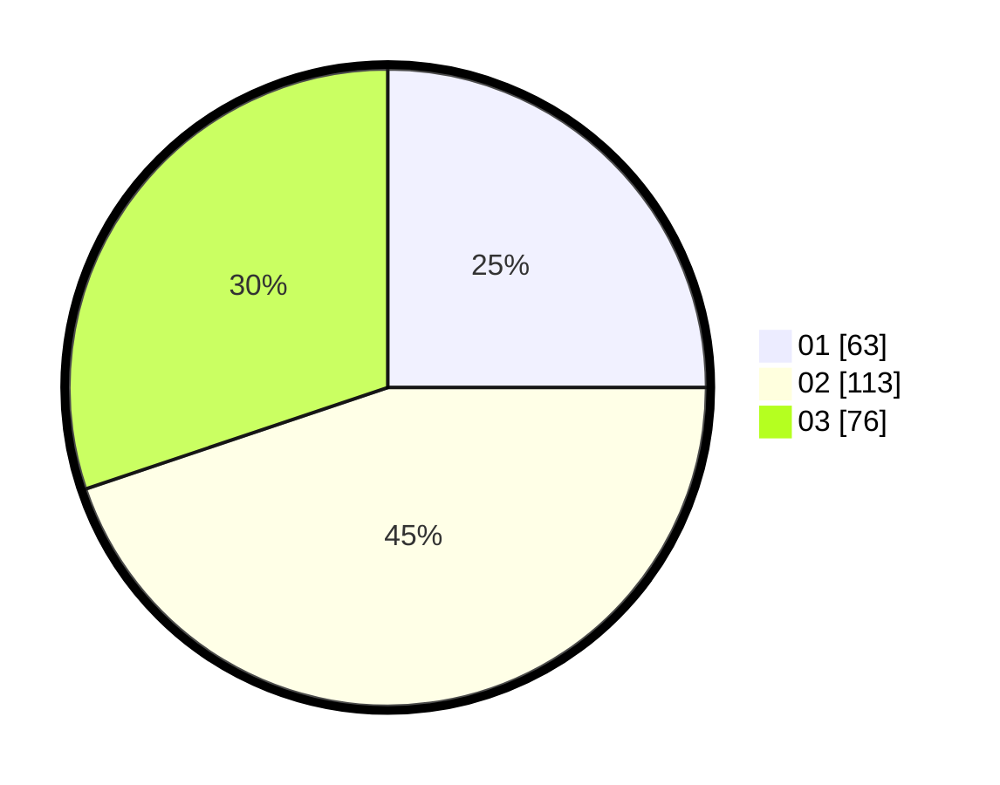

# Hasil

Hasil perolehan suara paslon dapat dilihat pada file paslon-01.txt, paslon-02.txt, dan paslon-03.txt.

Jika tidak ada, artinya data tersebut belum ada pada SIREKAP.

## Perolehan Suara

 * Paslon 01: **63**.
 * Paslon 02: **113**.
 * Paslon 03: **76**.

## Foto C Plano

https://sirekap-obj-formc.kpu.go.id/7a10/pemilu/ppwp/31/75/06/10/05/3175061005191-20240214-220616--39f46a5d-81ce-4e7e-bf6a-4bc0b9cb00dc.jpg

https://sirekap-obj-formc.kpu.go.id/7a10/pemilu/ppwp/31/75/06/10/05/3175061005191-20240214-220655--3d64194d-7ec0-4b20-9205-25cb5cee6c9d.jpg

https://sirekap-obj-formc.kpu.go.id/7a10/pemilu/ppwp/31/75/06/10/05/3175061005191-20240214-220730--95c64029-f138-436e-ae70-7f6a5bd15277.jpg

## DATA PEMILIH TETAP

Jumlah pemilih dalam DPT: **298**.
 * L: **143**.
 * P: **155**.

## DATA PENGGUNA HAK PILIH

Jumlah pengguna hak pilih dalam DPT: **207**.
 * L: **102**.
 * P: **105**.

Jumlah pengguna hak pilih dalam DPTb: **23**.
 * L: **10**.
 * P: **13**.

Jumlah pengguna hak pilih dalam DPK: **25**.
 * L: **13**.
 * P: **12**.

Jumlah pengguna hak pilih: **255**.
 * L: **125**.
 * P: **130**.

## JUMLAH SUARA SAH DAN TIDAK SAH

JUMLAH SELURUH SUARA SAH: **252**.

JUMLAH SUARA TIDAK SAH: **3**.

JUMLAH SELURUH SUARA SAH DAN SUARA TIDAK SAH: **255**.
