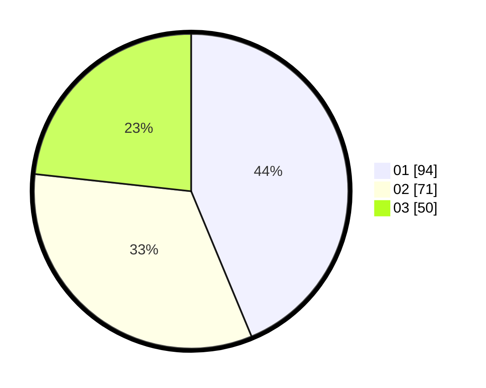

# Hasil

Hasil perolehan suara paslon dapat dilihat pada file paslon-01.txt, paslon-02.txt, dan paslon-03.txt.

Jika tidak ada, artinya data tersebut belum ada pada SIREKAP.

## Perolehan Suara

 * Paslon 01: **94**.
 * Paslon 02: **71**.
 * Paslon 03: **50**.

## Foto C Plano

https://sirekap-obj-formc.kpu.go.id/da5b/pemilu/ppwp/31/75/06/10/05/3175061005193-20240214-225101--fcf3531e-f662-4d80-8029-dd2991bbb69b.jpg

https://sirekap-obj-formc.kpu.go.id/da5b/pemilu/ppwp/31/75/06/10/05/3175061005193-20240214-230738--821cb170-6169-4786-b591-ddb0b8acdeed.jpg

https://sirekap-obj-formc.kpu.go.id/da5b/pemilu/ppwp/31/75/06/10/05/3175061005193-20240214-230839--04788b6f-2ed7-4cc2-9af2-412881c0454a.jpg

## DATA PEMILIH TETAP

Jumlah pemilih dalam DPT: **259**.
 * L: **129**.
 * P: **130**.

## DATA PENGGUNA HAK PILIH

Jumlah pengguna hak pilih dalam DPT: **215**.
 * L: **106**.
 * P: **109**.

Jumlah pengguna hak pilih dalam DPTb: **0**.
 * L: **0**.
 * P: **0**.

Jumlah pengguna hak pilih dalam DPK: **3**.
 * L: **3**.
 * P: **0**.

Jumlah pengguna hak pilih: **218**.
 * L: **109**.
 * P: **109**.

## JUMLAH SUARA SAH DAN TIDAK SAH

JUMLAH SELURUH SUARA SAH: **215**.

JUMLAH SUARA TIDAK SAH: **3**.

JUMLAH SELURUH SUARA SAH DAN SUARA TIDAK SAH: **218**.
