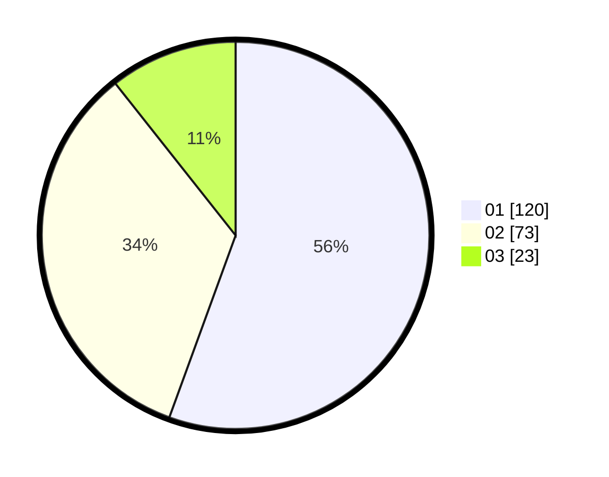

# Hasil

Hasil perolehan suara paslon dapat dilihat pada file paslon-01.txt, paslon-02.txt, dan paslon-03.txt.

Jika tidak ada, artinya data tersebut belum ada pada SIREKAP.

## Perolehan Suara

 * Paslon 01: **120**.
 * Paslon 02: **73**.
 * Paslon 03: **23**.

## Foto C Plano

https://sirekap-obj-formc.kpu.go.id/92dc/pemilu/ppwp/31/75/06/10/05/3175061005206-20240214-223935--28827e19-c1c9-4c07-a1cf-a3a75ed2c3d3.jpg

https://sirekap-obj-formc.kpu.go.id/92dc/pemilu/ppwp/31/75/06/10/05/3175061005206-20240214-203359--88566455-9355-4cba-b278-577ab446a3ef.jpg

https://sirekap-obj-formc.kpu.go.id/92dc/pemilu/ppwp/31/75/06/10/05/3175061005206-20240214-203422--4ce0c87d-ff74-4a51-965a-a0bd14742764.jpg

## DATA PEMILIH TETAP

Jumlah pemilih dalam DPT: **265**.
 * L: **132**.
 * P: **133**.

## DATA PENGGUNA HAK PILIH

Jumlah pengguna hak pilih dalam DPT: **217**.
 * L: **108**.
 * P: **109**.

Jumlah pengguna hak pilih dalam DPTb: **0**.
 * L: **0**.
 * P: **0**.

Jumlah pengguna hak pilih dalam DPK: **3**.
 * L: **1**.
 * P: **2**.

Jumlah pengguna hak pilih: **220**.
 * L: **109**.
 * P: **111**.

## JUMLAH SUARA SAH DAN TIDAK SAH

JUMLAH SELURUH SUARA SAH: **216**.

JUMLAH SUARA TIDAK SAH: **4**.

JUMLAH SELURUH SUARA SAH DAN SUARA TIDAK SAH: **220**.
