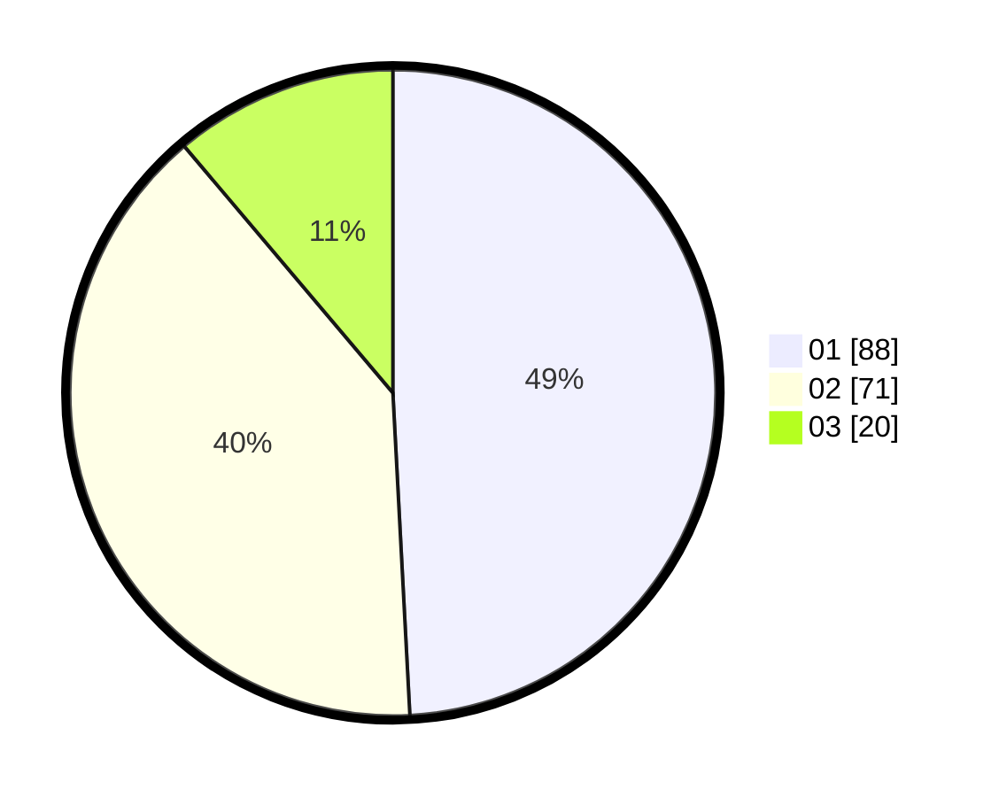

# Hasil

Hasil perolehan suara paslon dapat dilihat pada file paslon-01.txt, paslon-02.txt, dan paslon-03.txt.

Jika tidak ada, artinya data tersebut belum ada pada SIREKAP.

## Perolehan Suara

 * Paslon 01: **88**.
 * Paslon 02: **71**.
 * Paslon 03: **20**.

## Foto C Plano

https://sirekap-obj-formc.kpu.go.id/9fb8/pemilu/ppwp/31/75/06/10/05/3175061005207-20240214-191017--0568263e-d7e6-4016-87c1-606c061ea442.jpg

https://sirekap-obj-formc.kpu.go.id/9fb8/pemilu/ppwp/31/75/06/10/05/3175061005207-20240214-191021--10eb3cbb-c1a6-4673-95c0-27e8798228b5.jpg

https://sirekap-obj-formc.kpu.go.id/9fb8/pemilu/ppwp/31/75/06/10/05/3175061005207-20240214-191024--341a3682-d587-489d-a3b8-fb144172db6f.jpg

## DATA PEMILIH TETAP

Jumlah pemilih dalam DPT: **227**.
 * L: **105**.
 * P: **122**.

## DATA PENGGUNA HAK PILIH

Jumlah pengguna hak pilih dalam DPT: **168**.
 * L: **74**.
 * P: **94**.

Jumlah pengguna hak pilih dalam DPTb: **5**.
 * L: **2**.
 * P: **3**.

Jumlah pengguna hak pilih dalam DPK: **8**.
 * L: **3**.
 * P: **5**.

Jumlah pengguna hak pilih: **181**.
 * L: **79**.
 * P: **102**.

## JUMLAH SUARA SAH DAN TIDAK SAH

JUMLAH SELURUH SUARA SAH: **179**.

JUMLAH SUARA TIDAK SAH: **2**.

JUMLAH SELURUH SUARA SAH DAN SUARA TIDAK SAH: **181**.
