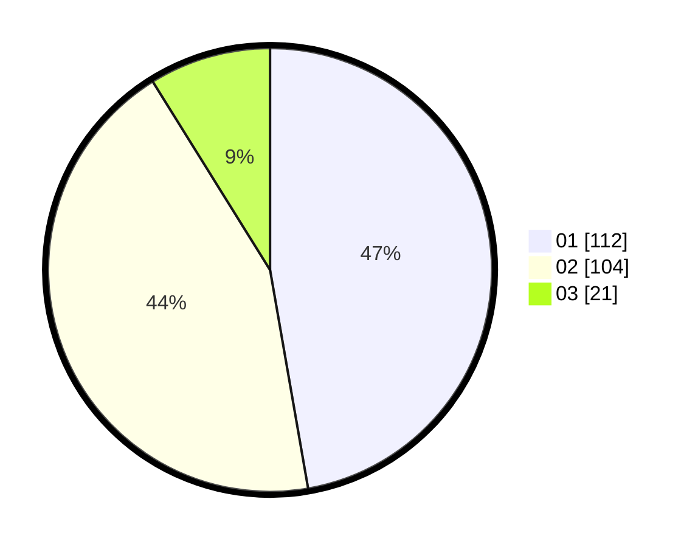

# Hasil

Hasil perolehan suara paslon dapat dilihat pada file paslon-01.txt, paslon-02.txt, dan paslon-03.txt.

Jika tidak ada, artinya data tersebut belum ada pada SIREKAP.

## Perolehan Suara

 * Paslon 01: **112**.
 * Paslon 02: **104**.
 * Paslon 03: **21**.

## Foto C Plano

https://sirekap-obj-formc.kpu.go.id/6552/pemilu/ppwp/31/75/06/10/05/3175061005210-20240214-234906--512db7ce-25ea-4278-8072-e58017408633.jpg

https://sirekap-obj-formc.kpu.go.id/6552/pemilu/ppwp/31/75/06/10/05/3175061005210-20240214-231818--f696ea9c-c93c-4c6f-a541-60f4a3303f5d.jpg

https://sirekap-obj-formc.kpu.go.id/6552/pemilu/ppwp/31/75/06/10/05/3175061005210-20240214-231916--3222b0d7-1e40-42c8-9cad-a5236380e0e0.jpg

## DATA PEMILIH TETAP

Jumlah pemilih dalam DPT: **277**.
 * L: **149**.
 * P: **128**.

## DATA PENGGUNA HAK PILIH

Jumlah pengguna hak pilih dalam DPT: **238**.
 * L: **121**.
 * P: **117**.

Jumlah pengguna hak pilih dalam DPTb: **2**.
 * L: **1**.
 * P: **1**.

Jumlah pengguna hak pilih dalam DPK: **1**.
 * L: **0**.
 * P: **1**.

Jumlah pengguna hak pilih: **241**.
 * L: **122**.
 * P: **119**.

## JUMLAH SUARA SAH DAN TIDAK SAH

JUMLAH SELURUH SUARA SAH: **237**.

JUMLAH SUARA TIDAK SAH: **4**.

JUMLAH SELURUH SUARA SAH DAN SUARA TIDAK SAH: **241**.
