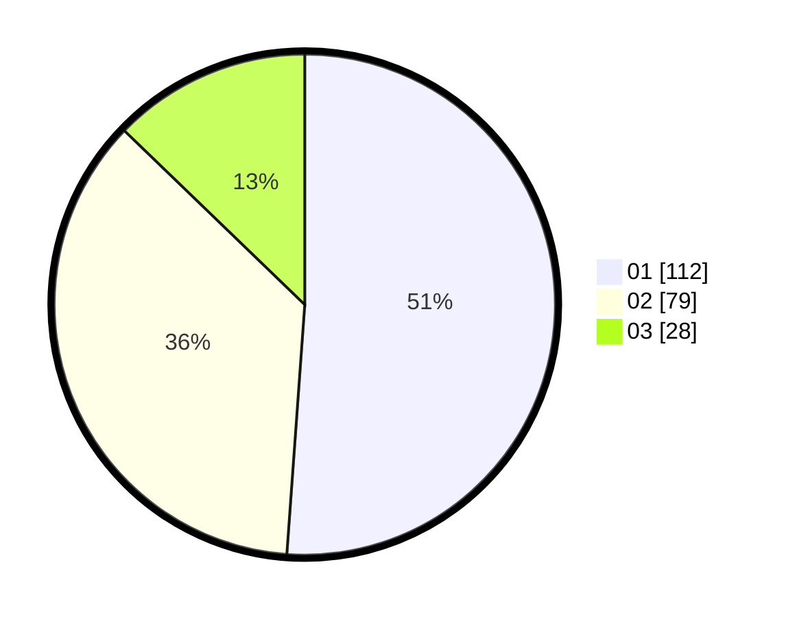

# Hasil

Hasil perolehan suara paslon dapat dilihat pada file paslon-01.txt, paslon-02.txt, dan paslon-03.txt.

Jika tidak ada, artinya data tersebut belum ada pada SIREKAP.

## Perolehan Suara

 * Paslon 01: **112**.
 * Paslon 02: **79**.
 * Paslon 03: **28**.

## Foto C Plano

https://sirekap-obj-formc.kpu.go.id/b57d/pemilu/ppwp/31/75/06/10/05/3175061005212-20240214-225026--00d9e926-6497-4ebf-b85b-b18a1f3cc4d3.jpg

https://sirekap-obj-formc.kpu.go.id/b57d/pemilu/ppwp/31/75/06/10/05/3175061005212-20240214-225152--e3e1c02e-5d97-4873-913e-49c5b063cb97.jpg

https://sirekap-obj-formc.kpu.go.id/b57d/pemilu/ppwp/31/75/06/10/05/3175061005212-20240214-225255--a78121c0-c6d3-43a3-a844-c729d36bd2f4.jpg
