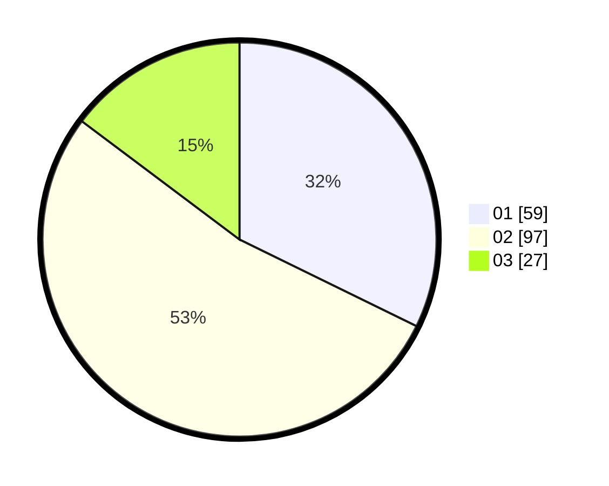

# Hasil

Hasil perolehan suara paslon dapat dilihat pada file paslon-01.txt, paslon-02.txt, dan paslon-03.txt.

Jika tidak ada, artinya data tersebut belum ada pada SIREKAP.

## Perolehan Suara

 * Paslon 01: **59**.
 * Paslon 02: **97**.
 * Paslon 03: **27**.

## Foto C Plano

https://sirekap-obj-formc.kpu.go.id/7de1/pemilu/ppwp/31/75/06/10/05/3175061005249-20240214-160057--81b022d8-01b5-4550-b842-65e7d1bf33b9.jpg

https://sirekap-obj-formc.kpu.go.id/7de1/pemilu/ppwp/31/75/06/10/05/3175061005249-20240214-160055--9c88562c-c1a2-46d2-bb11-e92cc2a5960b.jpg

https://sirekap-obj-formc.kpu.go.id/7de1/pemilu/ppwp/31/75/06/10/05/3175061005249-20240214-155441--3d110ac9-23f4-4031-b558-d37491ebb3f1.jpg

## DATA PEMILIH TETAP

Jumlah pemilih dalam DPT: **268**.
 * L: **137**.
 * P: **131**.

## DATA PENGGUNA HAK PILIH

Jumlah pengguna hak pilih dalam DPT: **179**.
 * L: **94**.
 * P: **85**.

Jumlah pengguna hak pilih dalam DPTb: **0**.
 * L: **0**.
 * P: **0**.

Jumlah pengguna hak pilih dalam DPK: **5**.
 * L: **2**.
 * P: **3**.

Jumlah pengguna hak pilih: **184**.
 * L: **96**.
 * P: **88**.

## JUMLAH SUARA SAH DAN TIDAK SAH

JUMLAH SELURUH SUARA SAH: **183**.

JUMLAH SUARA TIDAK SAH: **1**.

JUMLAH SELURUH SUARA SAH DAN SUARA TIDAK SAH: **184**.
