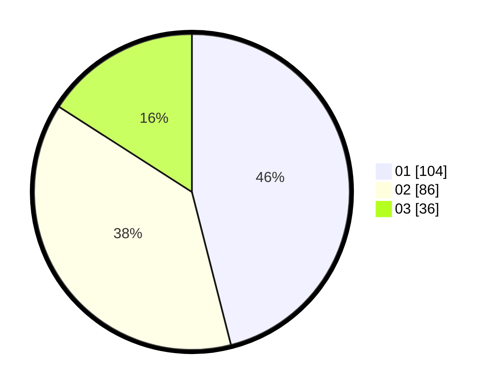

# Hasil

Hasil perolehan suara paslon dapat dilihat pada file paslon-01.txt, paslon-02.txt, dan paslon-03.txt.

Jika tidak ada, artinya data tersebut belum ada pada SIREKAP.

## Perolehan Suara

 * Paslon 01: **104**.
 * Paslon 02: **86**.
 * Paslon 03: **36**.

## Foto C Plano

https://sirekap-obj-formc.kpu.go.id/4441/pemilu/ppwp/31/75/06/10/05/3175061005256-20240215-175057--8bd19c5c-ac60-4d48-8115-9fb642b60b2a.jpg

https://sirekap-obj-formc.kpu.go.id/4441/pemilu/ppwp/31/75/06/10/05/3175061005256-20240215-175121--38bc59ee-4847-4226-9e49-5ede1c8e1210.jpg

https://sirekap-obj-formc.kpu.go.id/4441/pemilu/ppwp/31/75/06/10/05/3175061005256-20240215-175110--897e8a60-10d0-41dc-b117-8cceea5307fa.jpg

## DATA PEMILIH TETAP

Jumlah pemilih dalam DPT: **288**.
 * L: **143**.
 * P: **145**.

## DATA PENGGUNA HAK PILIH

Jumlah pengguna hak pilih dalam DPT: **225**.
 * L: **105**.
 * P: **120**.

Jumlah pengguna hak pilih dalam DPTb: **0**.
 * L: **0**.
 * P: **0**.

Jumlah pengguna hak pilih dalam DPK: **4**.
 * L: **1**.
 * P: **3**.

Jumlah pengguna hak pilih: **229**.
 * L: **106**.
 * P: **123**.

## JUMLAH SUARA SAH DAN TIDAK SAH

JUMLAH SELURUH SUARA SAH: **226**.

JUMLAH SUARA TIDAK SAH: **3**.

JUMLAH SELURUH SUARA SAH DAN SUARA TIDAK SAH: **229**.
