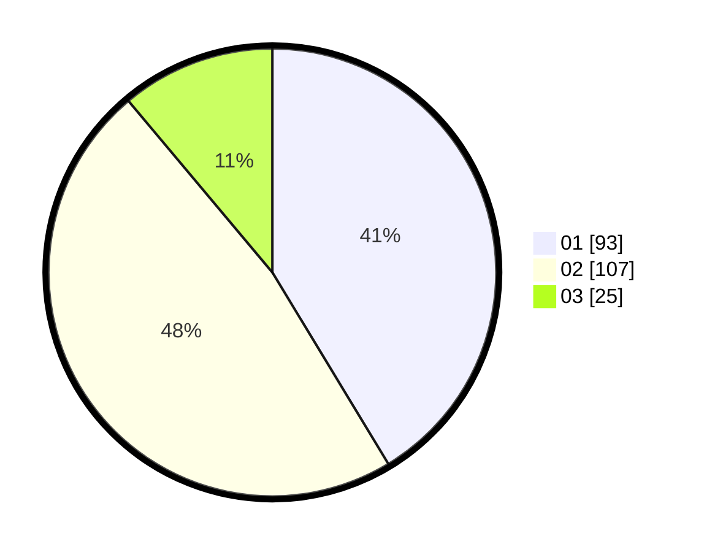

# Hasil

Hasil perolehan suara paslon dapat dilihat pada file paslon-01.txt, paslon-02.txt, dan paslon-03.txt.

Jika tidak ada, artinya data tersebut belum ada pada SIREKAP.

## Perolehan Suara

 * Paslon 01: **93**.
 * Paslon 02: **107**.
 * Paslon 03: **25**.

## Foto C Plano

https://sirekap-obj-formc.kpu.go.id/a5f3/pemilu/ppwp/31/75/06/10/05/3175061005258-20240215-031014--442e19ea-3962-4a4c-af8b-e7999f35a14d.jpg

https://sirekap-obj-formc.kpu.go.id/a5f3/pemilu/ppwp/31/75/06/10/05/3175061005258-20240215-031043--7bf8c776-0f78-46d8-846b-894540b035e3.jpg

https://sirekap-obj-formc.kpu.go.id/a5f3/pemilu/ppwp/31/75/06/10/05/3175061005258-20240215-031032--3d390ef2-7d5f-482a-87a9-68f1281f4465.jpg

## DATA PEMILIH TETAP

Jumlah pemilih dalam DPT: **282**.
 * L: **136**.
 * P: **146**.

## DATA PENGGUNA HAK PILIH

Jumlah pengguna hak pilih dalam DPT: **230**.
 * L: **103**.
 * P: **127**.

Jumlah pengguna hak pilih dalam DPTb: **0**.
 * L: **0**.
 * P: **0**.

Jumlah pengguna hak pilih dalam DPK: **3**.
 * L: **1**.
 * P: **2**.

Jumlah pengguna hak pilih: **233**.
 * L: **104**.
 * P: **129**.

## JUMLAH SUARA SAH DAN TIDAK SAH

JUMLAH SELURUH SUARA SAH: **225**.

JUMLAH SUARA TIDAK SAH: **8**.

JUMLAH SELURUH SUARA SAH DAN SUARA TIDAK SAH: **233**.
