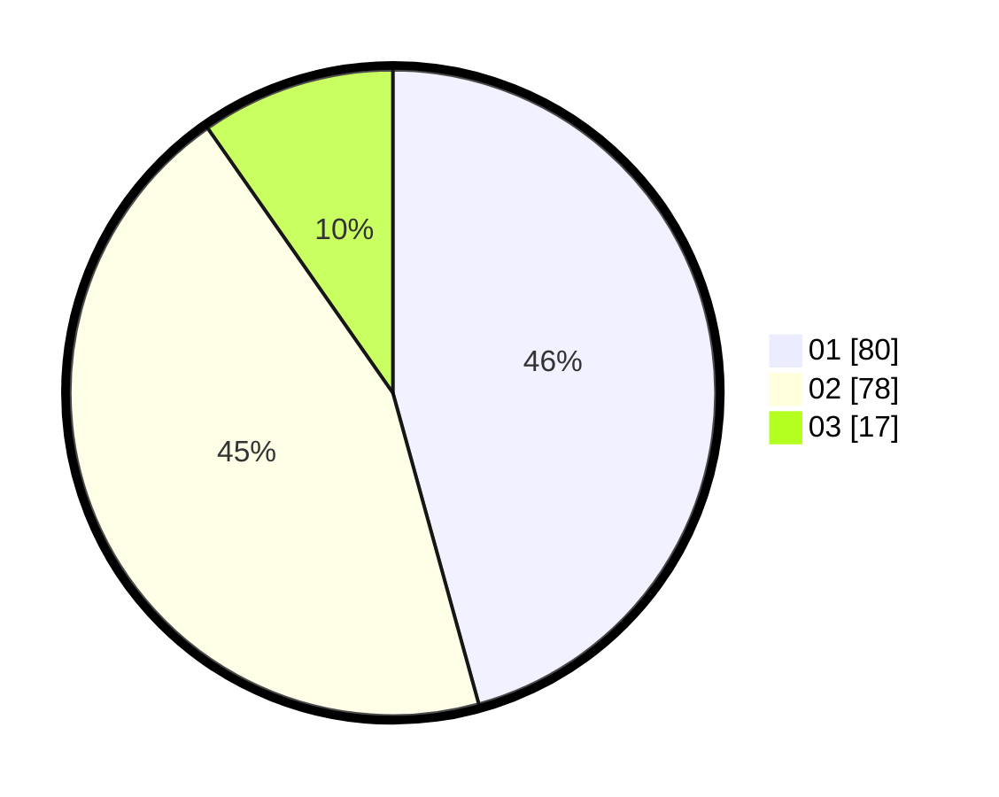

# Hasil

Hasil perolehan suara paslon dapat dilihat pada file paslon-01.txt, paslon-02.txt, dan paslon-03.txt.

Jika tidak ada, artinya data tersebut belum ada pada SIREKAP.

## Perolehan Suara

 * Paslon 01: **80**.
 * Paslon 02: **78**.
 * Paslon 03: **17**.

## Foto C Plano

https://sirekap-obj-formc.kpu.go.id/bb6b/pemilu/ppwp/31/75/06/10/05/3175061005264-20240214-215450--01a9dd10-07d1-4332-8bdf-b9463fd2d300.jpg

https://sirekap-obj-formc.kpu.go.id/bb6b/pemilu/ppwp/31/75/06/10/05/3175061005264-20240214-215759--7ec002a9-7377-4fb8-bc3b-f2d2dc096c69.jpg

https://sirekap-obj-formc.kpu.go.id/bb6b/pemilu/ppwp/31/75/06/10/05/3175061005264-20240214-215600--ec9a36ab-22e3-4687-9467-8e13446e02bc.jpg
