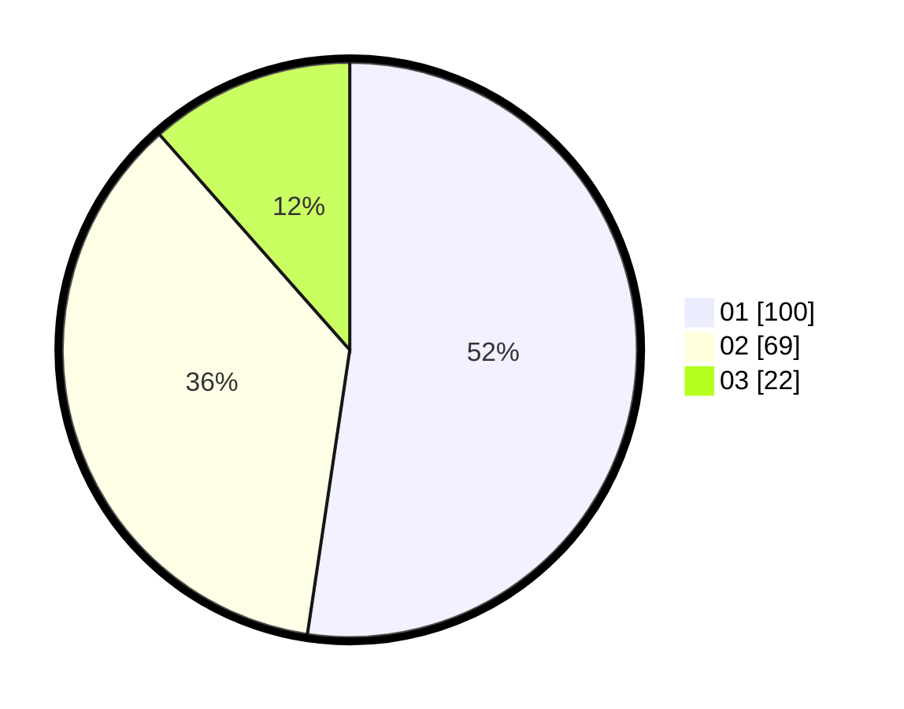

# Hasil

Hasil perolehan suara paslon dapat dilihat pada file paslon-01.txt, paslon-02.txt, dan paslon-03.txt.

Jika tidak ada, artinya data tersebut belum ada pada SIREKAP.

## Perolehan Suara

 * Paslon 01: **100**.
 * Paslon 02: **69**.
 * Paslon 03: **22**.

## Foto C Plano

https://sirekap-obj-formc.kpu.go.id/ce48/pemilu/ppwp/31/75/06/10/05/3175061005269-20240215-145047--267bd56b-b2d7-4606-b203-66d9c715cacd.jpg

https://sirekap-obj-formc.kpu.go.id/ce48/pemilu/ppwp/31/75/06/10/05/3175061005269-20240214-220945--3cdc4515-b0e4-4a52-a59e-7fdbd1fb067e.jpg

https://sirekap-obj-formc.kpu.go.id/ce48/pemilu/ppwp/31/75/06/10/05/3175061005269-20240214-221025--23f87d12-2e5d-4269-a21b-48d420582bce.jpg
