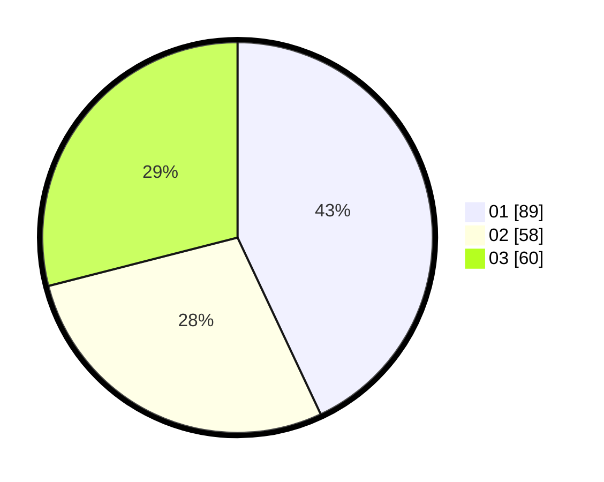

# Hasil

Hasil perolehan suara paslon dapat dilihat pada file paslon-01.txt, paslon-02.txt, dan paslon-03.txt.

Jika tidak ada, artinya data tersebut belum ada pada SIREKAP.

## Perolehan Suara

 * Paslon 01: **89**.
 * Paslon 02: **58**.
 * Paslon 03: **60**.

## Foto C Plano

https://sirekap-obj-formc.kpu.go.id/5477/pemilu/ppwp/31/75/06/10/05/3175061005278-20240214-184726--607013f9-0c1f-41ca-a9d9-5bdfb528d739.jpg

https://sirekap-obj-formc.kpu.go.id/5477/pemilu/ppwp/31/75/06/10/05/3175061005278-20240214-184738--08181605-7fc4-4127-a3bd-01012564010c.jpg

https://sirekap-obj-formc.kpu.go.id/5477/pemilu/ppwp/31/75/06/10/05/3175061005278-20240214-184743--8b7872cf-a684-495d-828e-19cc198f0dda.jpg

## DATA PEMILIH TETAP

Jumlah pemilih dalam DPT: **252**.
 * L: **116**.
 * P: **136**.

## DATA PENGGUNA HAK PILIH

Jumlah pengguna hak pilih dalam DPT: **208**.
 * L: **93**.
 * P: **115**.

Jumlah pengguna hak pilih dalam DPTb: **1**.
 * L: **1**.
 * P: **0**.

Jumlah pengguna hak pilih dalam DPK: **0**.
 * L: **0**.
 * P: **0**.

Jumlah pengguna hak pilih: **209**.
 * L: **94**.
 * P: **115**.

## JUMLAH SUARA SAH DAN TIDAK SAH

JUMLAH SELURUH SUARA SAH: **207**.

JUMLAH SUARA TIDAK SAH: **2**.

JUMLAH SELURUH SUARA SAH DAN SUARA TIDAK SAH: **209**.
