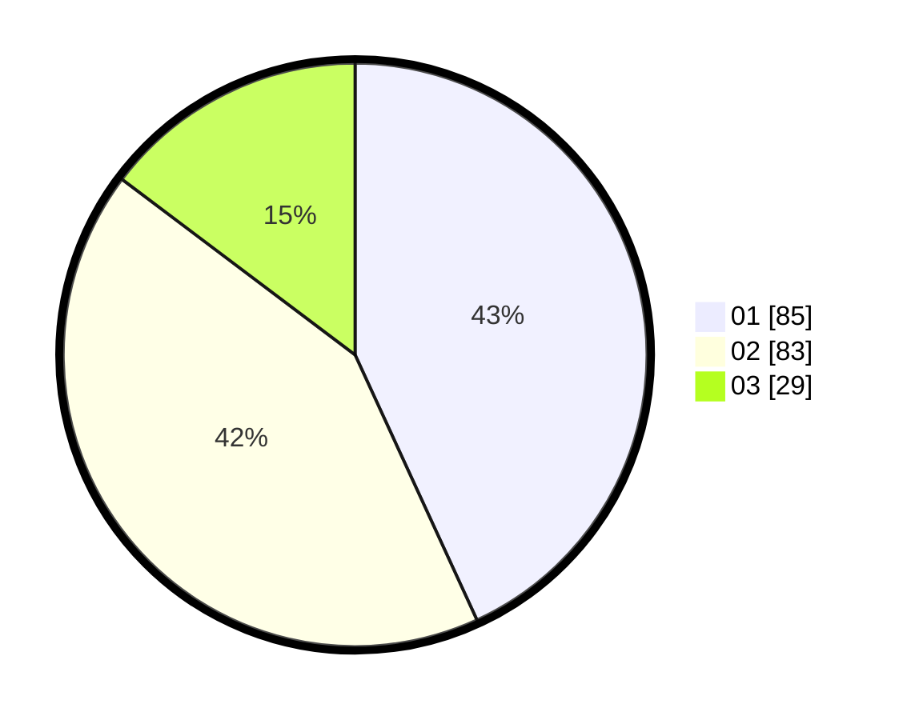

# Hasil

Hasil perolehan suara paslon dapat dilihat pada file paslon-01.txt, paslon-02.txt, dan paslon-03.txt.

Jika tidak ada, artinya data tersebut belum ada pada SIREKAP.

## Perolehan Suara

 * Paslon 01: **85**.
 * Paslon 02: **83**.
 * Paslon 03: **29**.

## Foto C Plano

https://sirekap-obj-formc.kpu.go.id/ebb9/pemilu/ppwp/31/75/06/10/05/3175061005299-20240214-211904--71e545cf-711b-48b7-879d-433e9d406148.jpg

https://sirekap-obj-formc.kpu.go.id/ebb9/pemilu/ppwp/31/75/06/10/05/3175061005299-20240215-030630--5d12f4d1-1356-4e62-b9db-cbb5b8ad3dff.jpg

https://sirekap-obj-formc.kpu.go.id/ebb9/pemilu/ppwp/31/75/06/10/05/3175061005299-20240215-030728--64987eb2-b4d5-4ea6-aaa2-f934e1b2c7f4.jpg

## DATA PEMILIH TETAP

Jumlah pemilih dalam DPT: **237**.
 * L: **117**.
 * P: **120**.

## DATA PENGGUNA HAK PILIH

Jumlah pengguna hak pilih dalam DPT: **190**.
 * L: **93**.
 * P: **97**.

Jumlah pengguna hak pilih dalam DPTb: **3**.
 * L: **2**.
 * P: **1**.

Jumlah pengguna hak pilih dalam DPK: **4**.
 * L: **3**.
 * P: **1**.

Jumlah pengguna hak pilih: **197**.
 * L: **98**.
 * P: **99**.

## JUMLAH SUARA SAH DAN TIDAK SAH

JUMLAH SELURUH SUARA SAH: **197**.

JUMLAH SUARA TIDAK SAH: **0**.

JUMLAH SELURUH SUARA SAH DAN SUARA TIDAK SAH: **197**.
