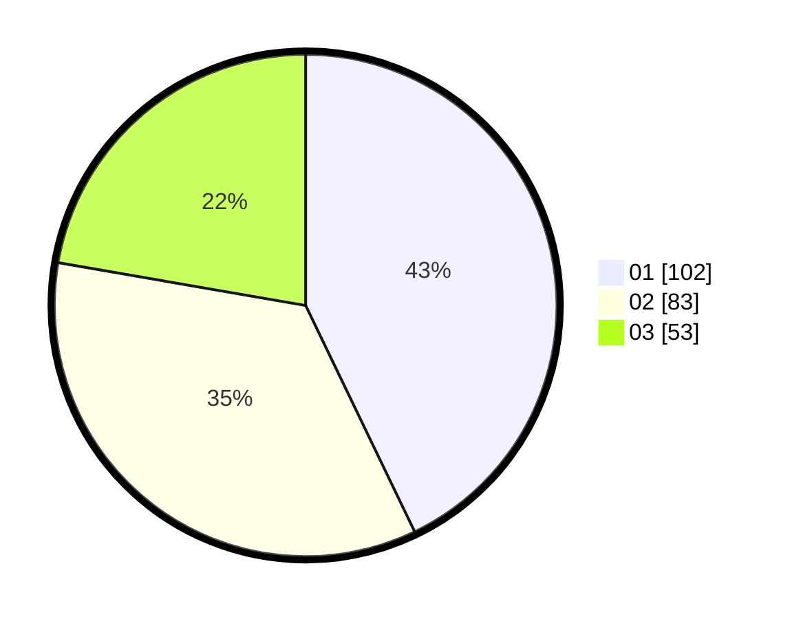

# Hasil

Hasil perolehan suara paslon dapat dilihat pada file paslon-01.txt, paslon-02.txt, dan paslon-03.txt.

Jika tidak ada, artinya data tersebut belum ada pada SIREKAP.

## Perolehan Suara

 * Paslon 01: **102**.
 * Paslon 02: **83**.
 * Paslon 03: **53**.

## Foto C Plano

https://sirekap-obj-formc.kpu.go.id/1978/pemilu/ppwp/31/75/06/10/05/3175061005310-20240214-200602--3ea3864c-d7c4-4736-8eb6-0e0b5c317840.jpg

https://sirekap-obj-formc.kpu.go.id/1978/pemilu/ppwp/31/75/06/10/05/3175061005310-20240214-211421--cb0affd9-c52a-424e-b059-f920d25bfe5b.jpg

https://sirekap-obj-formc.kpu.go.id/1978/pemilu/ppwp/31/75/06/10/05/3175061005310-20240214-192500--0ec80c58-864b-4b2e-8a54-a05c1375afd1.jpg

## DATA PEMILIH TETAP

Jumlah pemilih dalam DPT: **740**.
 * L: **177**.
 * P: **157**.

## DATA PENGGUNA HAK PILIH

Jumlah pengguna hak pilih dalam DPT: **277**.
 * L: **175**.
 * P: **177**.

Jumlah pengguna hak pilih dalam DPTb: **7**.
 * L: **1**.
 * P: **5**.

Jumlah pengguna hak pilih dalam DPK: **0**.
 * L: **0**.
 * P: **0**.

Jumlah pengguna hak pilih: **744**.
 * L: **105**.
 * P: **174**.

## JUMLAH SUARA SAH DAN TIDAK SAH

JUMLAH SELURUH SUARA SAH: **238**.

JUMLAH SUARA TIDAK SAH: **6**.

JUMLAH SELURUH SUARA SAH DAN SUARA TIDAK SAH: **244**.
