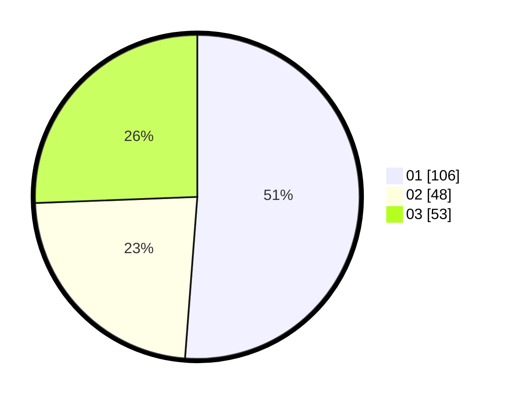

# Hasil

Hasil perolehan suara paslon dapat dilihat pada file paslon-01.txt, paslon-02.txt, dan paslon-03.txt.

Jika tidak ada, artinya data tersebut belum ada pada SIREKAP.

## Perolehan Suara

 * Paslon 01: **106**.
 * Paslon 02: **48**.
 * Paslon 03: **53**.

## Foto C Plano

https://sirekap-obj-formc.kpu.go.id/8f42/pemilu/ppwp/31/75/06/10/05/3175061005313-20240214-193956--dca611a1-dc72-4871-b723-d1986e3db494.jpg

https://sirekap-obj-formc.kpu.go.id/8f42/pemilu/ppwp/31/75/06/10/05/3175061005313-20240214-194239--620f11fa-4fad-48af-bfbc-ebf89eae2f2f.jpg

https://sirekap-obj-formc.kpu.go.id/8f42/pemilu/ppwp/31/75/06/10/05/3175061005313-20240214-192840--e3837d0e-975b-4e1a-96d7-847a70ae0d6d.jpg

## DATA PEMILIH TETAP

Jumlah pemilih dalam DPT: **261**.
 * L: **125**.
 * P: **136**.

## DATA PENGGUNA HAK PILIH

Jumlah pengguna hak pilih dalam DPT: **207**.
 * L: **94**.
 * P: **113**.

Jumlah pengguna hak pilih dalam DPTb: **0**.
 * L: **0**.
 * P: **0**.

Jumlah pengguna hak pilih dalam DPK: **1**.
 * L: **0**.
 * P: **1**.

Jumlah pengguna hak pilih: **208**.
 * L: **94**.
 * P: **114**.

## JUMLAH SUARA SAH DAN TIDAK SAH

JUMLAH SELURUH SUARA SAH: **207**.

JUMLAH SUARA TIDAK SAH: **1**.

JUMLAH SELURUH SUARA SAH DAN SUARA TIDAK SAH: **208**.
