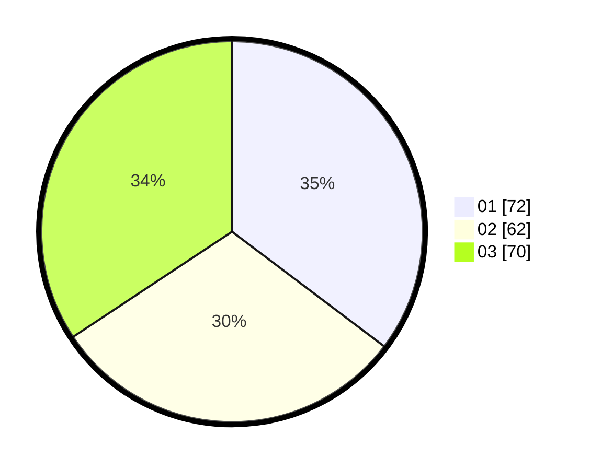

# Hasil

Hasil perolehan suara paslon dapat dilihat pada file paslon-01.txt, paslon-02.txt, dan paslon-03.txt.

Jika tidak ada, artinya data tersebut belum ada pada SIREKAP.

## Perolehan Suara

 * Paslon 01: **72**.
 * Paslon 02: **62**.
 * Paslon 03: **70**.

## Foto C Plano

https://sirekap-obj-formc.kpu.go.id/1ad0/pemilu/ppwp/31/75/06/10/05/3175061005316-20240214-221951--cea7efec-9c3f-4953-bebe-628fe06893bf.jpg

https://sirekap-obj-formc.kpu.go.id/1ad0/pemilu/ppwp/31/75/06/10/05/3175061005316-20240214-221147--f67c258a-db75-40b8-b9d9-d4c1e56b34b4.jpg
