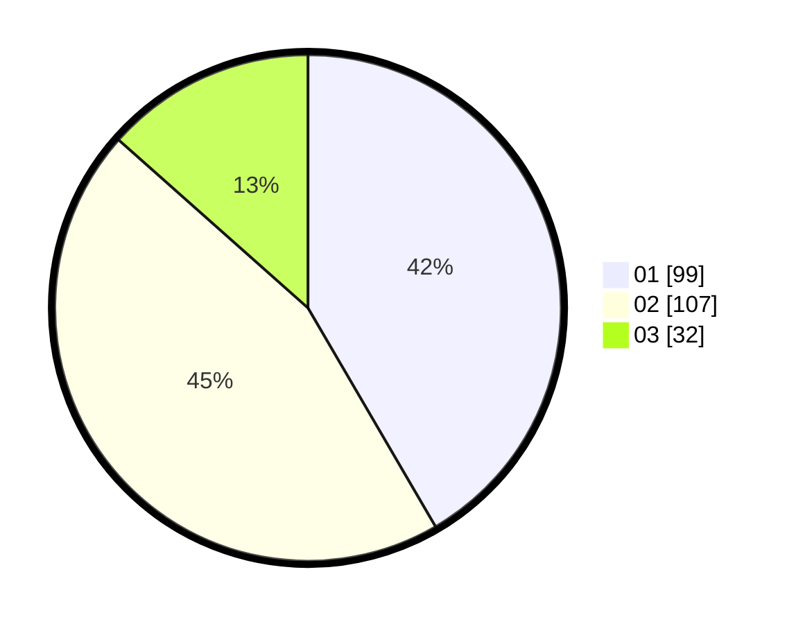

# Hasil

Hasil perolehan suara paslon dapat dilihat pada file paslon-01.txt, paslon-02.txt, dan paslon-03.txt.

Jika tidak ada, artinya data tersebut belum ada pada SIREKAP.

## Perolehan Suara

 * Paslon 01: **99**.
 * Paslon 02: **107**.
 * Paslon 03: **32**.

## Foto C Plano

https://sirekap-obj-formc.kpu.go.id/350c/pemilu/ppwp/31/75/06/10/05/3175061005326-20240214-192827--519d4f80-085e-4ae3-a9c6-9b5e171537cc.jpg

https://sirekap-obj-formc.kpu.go.id/350c/pemilu/ppwp/31/75/06/10/05/3175061005326-20240214-212512--7cb1b88d-8dea-471f-bfae-79f5a81c5989.jpg

https://sirekap-obj-formc.kpu.go.id/350c/pemilu/ppwp/31/75/06/10/05/3175061005326-20240214-194944--42c92465-f3f1-43d2-aef8-e700754104a2.jpg

## DATA PEMILIH TETAP

Jumlah pemilih dalam DPT: **277**.
 * L: **145**.
 * P: **132**.

## DATA PENGGUNA HAK PILIH

Jumlah pengguna hak pilih dalam DPT: **236**.
 * L: **120**.
 * P: **116**.

Jumlah pengguna hak pilih dalam DPTb: **0**.
 * L: **0**.
 * P: **0**.

Jumlah pengguna hak pilih dalam DPK: **2**.
 * L: **1**.
 * P: **1**.

Jumlah pengguna hak pilih: **238**.
 * L: **121**.
 * P: **117**.

## JUMLAH SUARA SAH DAN TIDAK SAH

JUMLAH SELURUH SUARA SAH: **238**.

JUMLAH SUARA TIDAK SAH: **0**.

JUMLAH SELURUH SUARA SAH DAN SUARA TIDAK SAH: **238**.
