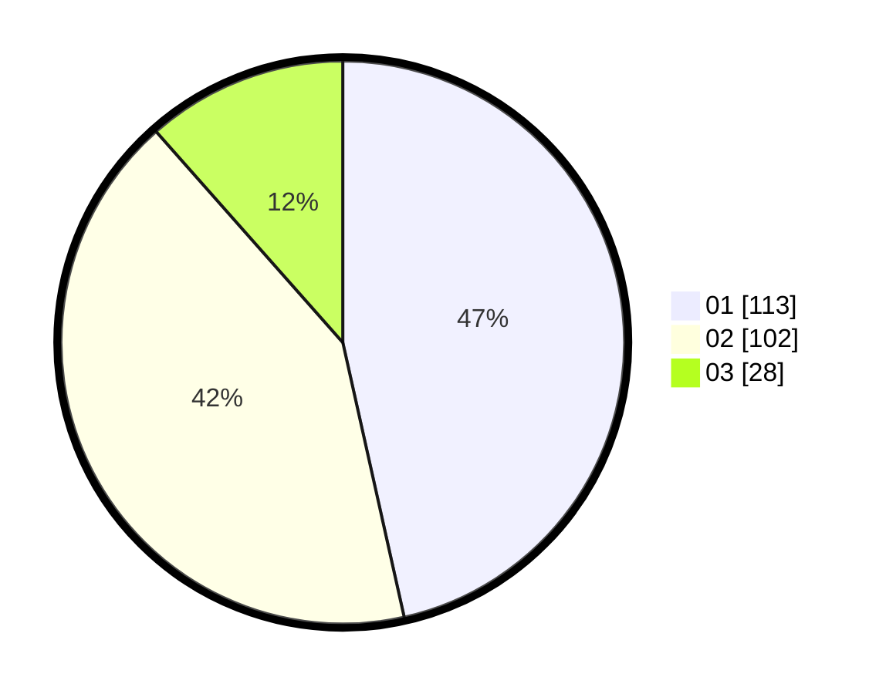

# Hasil

Hasil perolehan suara paslon dapat dilihat pada file paslon-01.txt, paslon-02.txt, dan paslon-03.txt.

Jika tidak ada, artinya data tersebut belum ada pada SIREKAP.

## Perolehan Suara

 * Paslon 01: **113**.
 * Paslon 02: **102**.
 * Paslon 03: **28**.

## Foto C Plano

https://sirekap-obj-formc.kpu.go.id/af19/pemilu/ppwp/31/75/06/10/05/3175061005329-20240214-232024--5a6d604e-2f82-404a-9d2c-508cf6386494.jpg

https://sirekap-obj-formc.kpu.go.id/af19/pemilu/ppwp/31/75/06/10/05/3175061005329-20240214-233011--f685e7e9-fb4b-4cf1-aed1-a9504d3cfd50.jpg

https://sirekap-obj-formc.kpu.go.id/af19/pemilu/ppwp/31/75/06/10/05/3175061005329-20240214-233103--25591318-da84-4dbd-aa76-f719cbfa0bb2.jpg
