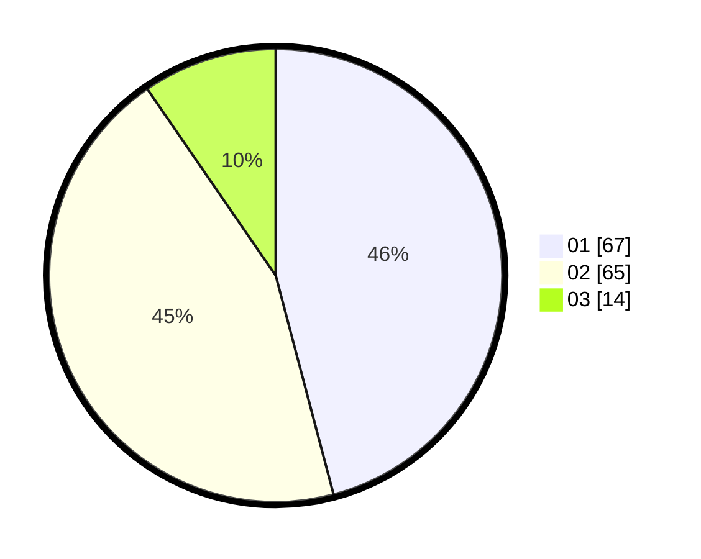

# Hasil

Hasil perolehan suara paslon dapat dilihat pada file paslon-01.txt, paslon-02.txt, dan paslon-03.txt.

Jika tidak ada, artinya data tersebut belum ada pada SIREKAP.

## Perolehan Suara

 * Paslon 01: **67**.
 * Paslon 02: **65**.
 * Paslon 03: **14**.

## Foto C Plano

https://sirekap-obj-formc.kpu.go.id/9196/pemilu/ppwp/31/75/06/10/05/3175061005338-20240214-140957--8accec43-ff80-4691-9297-ec52a861bee8.jpg

https://sirekap-obj-formc.kpu.go.id/9196/pemilu/ppwp/31/75/06/10/05/3175061005338-20240214-141320--be7351e8-0e00-4250-8447-24e73dbb0efd.jpg

https://sirekap-obj-formc.kpu.go.id/9196/pemilu/ppwp/31/75/06/10/05/3175061005338-20240214-141701--38d000b4-b5f3-4a45-9ab8-e6c3286eb108.jpg

## DATA PEMILIH TETAP

Jumlah pemilih dalam DPT: **195**.
 * L: **99**.
 * P: **96**.

## DATA PENGGUNA HAK PILIH

Jumlah pengguna hak pilih dalam DPT: **146**.
 * L: **71**.
 * P: **75**.

Jumlah pengguna hak pilih dalam DPTb: **1**.
 * L: **0**.
 * P: **1**.

Jumlah pengguna hak pilih dalam DPK: **0**.
 * L: **0**.
 * P: **0**.

Jumlah pengguna hak pilih: **147**.
 * L: **71**.
 * P: **76**.

## JUMLAH SUARA SAH DAN TIDAK SAH

JUMLAH SELURUH SUARA SAH: **146**.

JUMLAH SUARA TIDAK SAH: **1**.

JUMLAH SELURUH SUARA SAH DAN SUARA TIDAK SAH: **147**.
