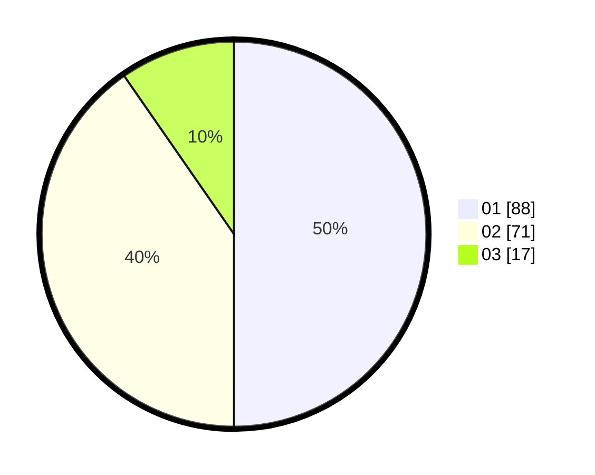

# Hasil

Hasil perolehan suara paslon dapat dilihat pada file paslon-01.txt, paslon-02.txt, dan paslon-03.txt.

Jika tidak ada, artinya data tersebut belum ada pada SIREKAP.

## Perolehan Suara

 * Paslon 01: **88**.
 * Paslon 02: **71**.
 * Paslon 03: **17**.

## Foto C Plano

https://sirekap-obj-formc.kpu.go.id/6854/pemilu/ppwp/31/75/06/10/05/3175061005339-20240214-211334--744d4752-6f54-468e-8af6-670f0c340de7.jpg

https://sirekap-obj-formc.kpu.go.id/6854/pemilu/ppwp/31/75/06/10/05/3175061005339-20240214-192842--34ceb260-ac3c-4227-a260-5e3305d88d93.jpg

https://sirekap-obj-formc.kpu.go.id/6854/pemilu/ppwp/31/75/06/10/05/3175061005339-20240214-192858--fa99f305-0011-447e-a175-b68a24a30a4e.jpg

## DATA PEMILIH TETAP

Jumlah pemilih dalam DPT: **203**.
 * L: **104**.
 * P: **99**.

## DATA PENGGUNA HAK PILIH

Jumlah pengguna hak pilih dalam DPT: **176**.
 * L: **86**.
 * P: **90**.

Jumlah pengguna hak pilih dalam DPTb: **1**.
 * L: **0**.
 * P: **1**.

Jumlah pengguna hak pilih dalam DPK: **0**.
 * L: **0**.
 * P: **0**.

Jumlah pengguna hak pilih: **177**.
 * L: **86**.
 * P: **91**.

## JUMLAH SUARA SAH DAN TIDAK SAH

JUMLAH SELURUH SUARA SAH: **176**.

JUMLAH SUARA TIDAK SAH: **1**.

JUMLAH SELURUH SUARA SAH DAN SUARA TIDAK SAH: **177**.
