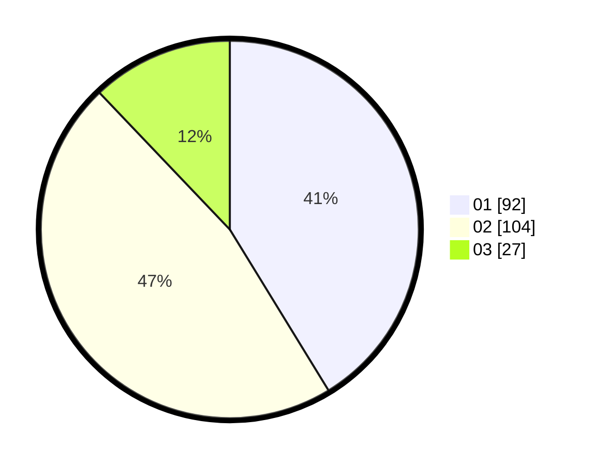

# Hasil

Hasil perolehan suara paslon dapat dilihat pada file paslon-01.txt, paslon-02.txt, dan paslon-03.txt.

Jika tidak ada, artinya data tersebut belum ada pada SIREKAP.

## Perolehan Suara

 * Paslon 01: **92**.
 * Paslon 02: **104**.
 * Paslon 03: **27**.

## Foto C Plano

https://sirekap-obj-formc.kpu.go.id/d90a/pemilu/ppwp/31/75/06/10/05/3175061005343-20240214-193707--52b3b1a2-b907-4d37-9a44-0a961c2d30b7.jpg

https://sirekap-obj-formc.kpu.go.id/d90a/pemilu/ppwp/31/75/06/10/05/3175061005343-20240214-193832--f23db7a1-6b9a-4371-aeb2-b596abb0ecda.jpg
