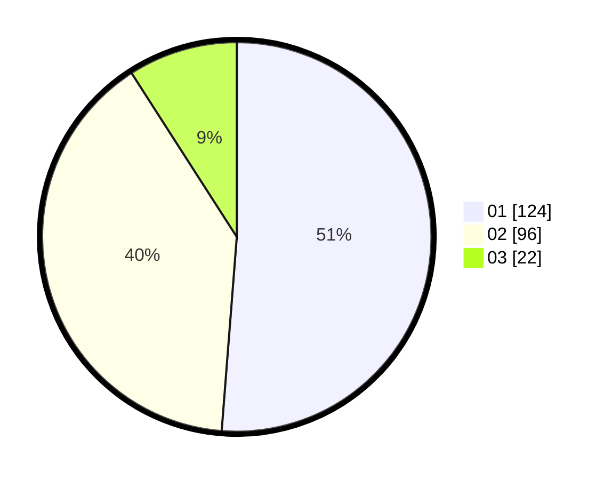

# Hasil

Hasil perolehan suara paslon dapat dilihat pada file paslon-01.txt, paslon-02.txt, dan paslon-03.txt.

Jika tidak ada, artinya data tersebut belum ada pada SIREKAP.

## Perolehan Suara

 * Paslon 01: **124**.
 * Paslon 02: **96**.
 * Paslon 03: **22**.

## Foto C Plano

https://sirekap-obj-formc.kpu.go.id/ad4e/pemilu/ppwp/31/75/06/10/05/3175061005349-20240214-222316--987cdc7e-5bd7-4320-8b9f-0c7c97e6e0e8.jpg

https://sirekap-obj-formc.kpu.go.id/ad4e/pemilu/ppwp/31/75/06/10/05/3175061005349-20240214-222458--8f035dce-cf53-4543-b7f0-c3ad68af06e6.jpg

https://sirekap-obj-formc.kpu.go.id/ad4e/pemilu/ppwp/31/75/06/10/05/3175061005349-20240214-222709--b49280db-d927-4c5a-a023-6ad5efe56fca.jpg
