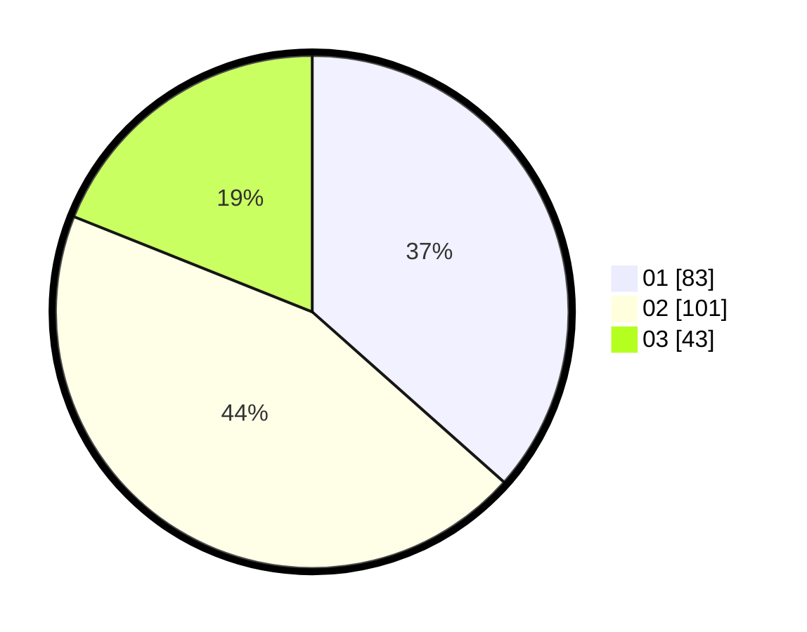

# Hasil

Hasil perolehan suara paslon dapat dilihat pada file paslon-01.txt, paslon-02.txt, dan paslon-03.txt.

Jika tidak ada, artinya data tersebut belum ada pada SIREKAP.

## Perolehan Suara

 * Paslon 01: **83**.
 * Paslon 02: **101**.
 * Paslon 03: **43**.

## Foto C Plano

https://sirekap-obj-formc.kpu.go.id/596c/pemilu/ppwp/31/75/06/10/06/3175061006005-20240214-213007--0c700f40-7042-4f37-b9c2-1fd80ba12d04.jpg

https://sirekap-obj-formc.kpu.go.id/596c/pemilu/ppwp/31/75/06/10/06/3175061006005-20240214-213037--56767479-ee36-4b9b-8624-34faef9280be.jpg

https://sirekap-obj-formc.kpu.go.id/596c/pemilu/ppwp/31/75/06/10/06/3175061006005-20240214-213103--28e3f764-2b6b-4dc9-bc08-e2df88fe9f0f.jpg

## DATA PEMILIH TETAP

Jumlah pemilih dalam DPT: **279**.
 * L: **134**.
 * P: **145**.

## DATA PENGGUNA HAK PILIH

Jumlah pengguna hak pilih dalam DPT: **231**.
 * L: **110**.
 * P: **121**.

Jumlah pengguna hak pilih dalam DPTb: **0**.
 * L: **0**.
 * P: **0**.

Jumlah pengguna hak pilih dalam DPK: **0**.
 * L: **0**.
 * P: **0**.

Jumlah pengguna hak pilih: **231**.
 * L: **110**.
 * P: **121**.

## JUMLAH SUARA SAH DAN TIDAK SAH

JUMLAH SELURUH SUARA SAH: **227**.

JUMLAH SUARA TIDAK SAH: **4**.

JUMLAH SELURUH SUARA SAH DAN SUARA TIDAK SAH: **231**.
