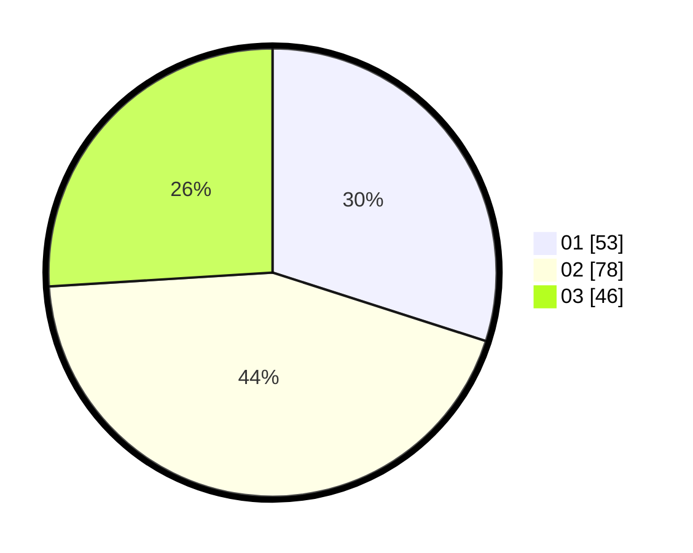

# Hasil

Hasil perolehan suara paslon dapat dilihat pada file paslon-01.txt, paslon-02.txt, dan paslon-03.txt.

Jika tidak ada, artinya data tersebut belum ada pada SIREKAP.

## Perolehan Suara

 * Paslon 01: **53**.
 * Paslon 02: **78**.
 * Paslon 03: **46**.

## Foto C Plano

https://sirekap-obj-formc.kpu.go.id/3e9e/pemilu/ppwp/31/75/06/10/06/3175061006010-20240214-205620--a99c401b-d3f3-444b-9363-4da1d2d42be3.jpg

https://sirekap-obj-formc.kpu.go.id/3e9e/pemilu/ppwp/31/75/06/10/06/3175061006010-20240214-205649--beb094c5-bbb6-4445-b91f-e859fcedd43d.jpg

https://sirekap-obj-formc.kpu.go.id/3e9e/pemilu/ppwp/31/75/06/10/06/3175061006010-20240214-205713--3b39bb35-2acd-41be-b14c-2cb8c8109706.jpg

## DATA PEMILIH TETAP

Jumlah pemilih dalam DPT: **226**.
 * L: **111**.
 * P: **115**.

## DATA PENGGUNA HAK PILIH

Jumlah pengguna hak pilih dalam DPT: **177**.
 * L: **83**.
 * P: **94**.

Jumlah pengguna hak pilih dalam DPTb: **0**.
 * L: **0**.
 * P: **0**.

Jumlah pengguna hak pilih dalam DPK: **1**.
 * L: **1**.
 * P: **0**.

Jumlah pengguna hak pilih: **178**.
 * L: **84**.
 * P: **94**.

## JUMLAH SUARA SAH DAN TIDAK SAH

JUMLAH SELURUH SUARA SAH: **177**.

JUMLAH SUARA TIDAK SAH: **1**.

JUMLAH SELURUH SUARA SAH DAN SUARA TIDAK SAH: **178**.
