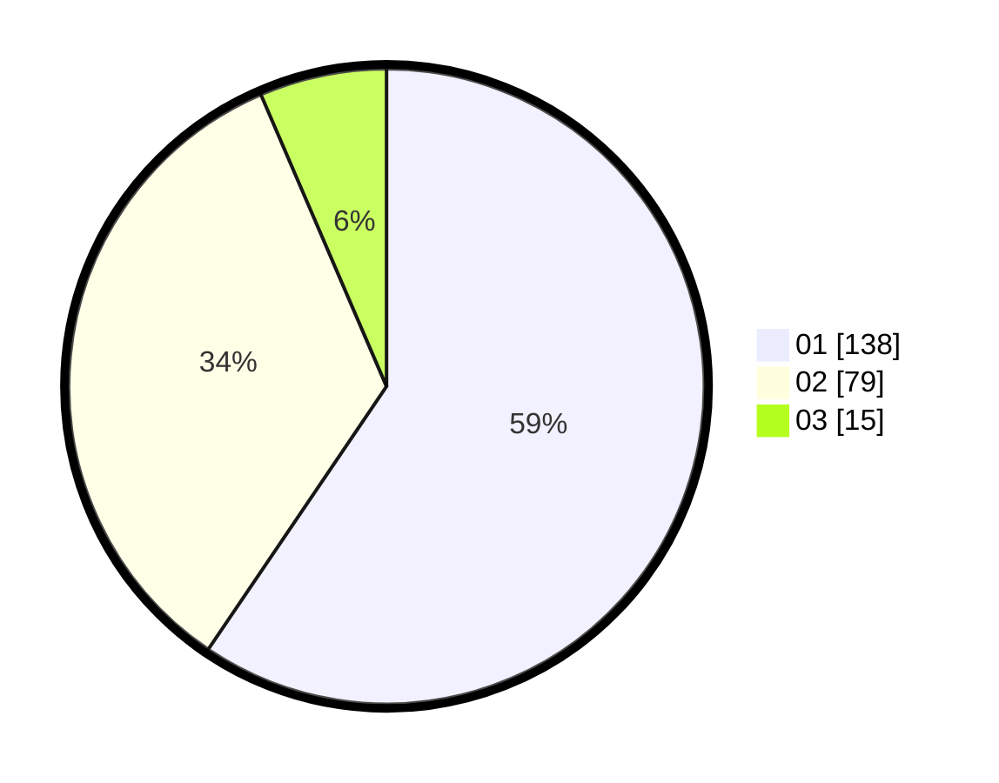

# Hasil

Hasil perolehan suara paslon dapat dilihat pada file paslon-01.txt, paslon-02.txt, dan paslon-03.txt.

Jika tidak ada, artinya data tersebut belum ada pada SIREKAP.

## Perolehan Suara

 * Paslon 01: **138**.
 * Paslon 02: **79**.
 * Paslon 03: **15**.

## Foto C Plano

https://sirekap-obj-formc.kpu.go.id/0fdd/pemilu/ppwp/31/75/06/10/06/3175061006021-20240214-162208--9339358b-8127-427f-b5c3-ca967f9e38fa.jpg

https://sirekap-obj-formc.kpu.go.id/0fdd/pemilu/ppwp/31/75/06/10/06/3175061006021-20240214-192350--81bd6e9b-aad6-43e5-8e28-cd8b9ac745da.jpg

https://sirekap-obj-formc.kpu.go.id/0fdd/pemilu/ppwp/31/75/06/10/06/3175061006021-20240214-192411--b0a17de3-6cd5-4b0a-9178-5e1744ee45fd.jpg
