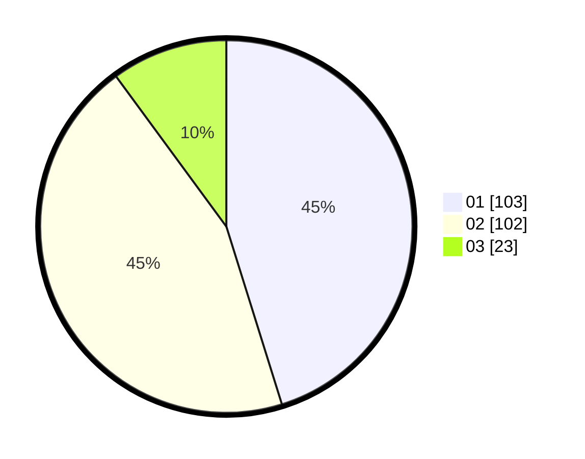

# Hasil

Hasil perolehan suara paslon dapat dilihat pada file paslon-01.txt, paslon-02.txt, dan paslon-03.txt.

Jika tidak ada, artinya data tersebut belum ada pada SIREKAP.

## Perolehan Suara

 * Paslon 01: **103**.
 * Paslon 02: **102**.
 * Paslon 03: **23**.

## Foto C Plano

https://sirekap-obj-formc.kpu.go.id/febc/pemilu/ppwp/31/75/06/10/06/3175061006065-20240215-003216--f364c797-c013-405b-8136-a4141ec79bc3.jpg

https://sirekap-obj-formc.kpu.go.id/febc/pemilu/ppwp/31/75/06/10/06/3175061006065-20240215-003219--24de5b23-f850-419a-847e-28bc9886d7f0.jpg

https://sirekap-obj-formc.kpu.go.id/febc/pemilu/ppwp/31/75/06/10/06/3175061006065-20240214-233000--836f95f8-ced9-4b6b-b9e1-4b03e6d08bcf.jpg

## DATA PEMILIH TETAP

Jumlah pemilih dalam DPT: **284**.
 * L: **150**.
 * P: **134**.

## DATA PENGGUNA HAK PILIH

Jumlah pengguna hak pilih dalam DPT: **224**.
 * L: **117**.
 * P: **107**.

Jumlah pengguna hak pilih dalam DPTb: **1**.
 * L: **1**.
 * P: **0**.

Jumlah pengguna hak pilih dalam DPK: **3**.
 * L: **2**.
 * P: **1**.

Jumlah pengguna hak pilih: **228**.
 * L: **120**.
 * P: **108**.

## JUMLAH SUARA SAH DAN TIDAK SAH

JUMLAH SELURUH SUARA SAH: **228**.

JUMLAH SUARA TIDAK SAH: **0**.

JUMLAH SELURUH SUARA SAH DAN SUARA TIDAK SAH: **228**.
