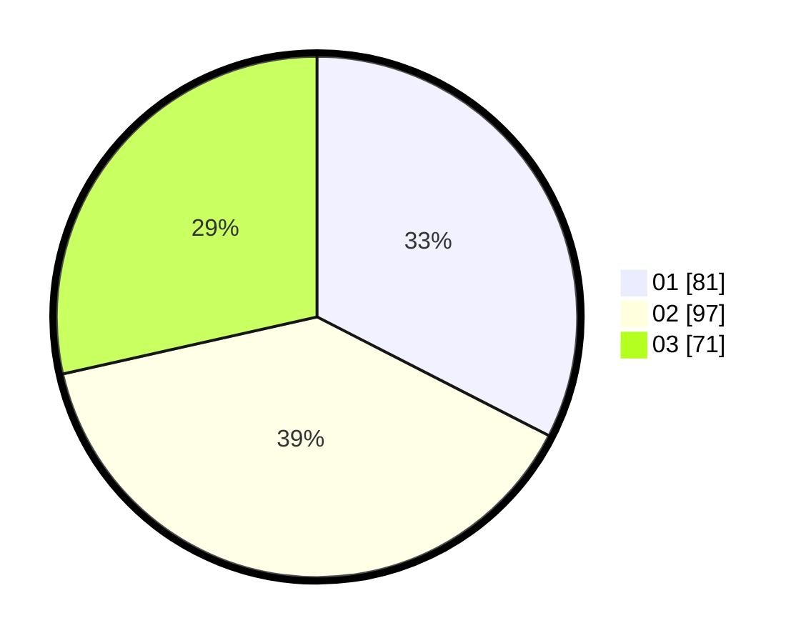

# Hasil

Hasil perolehan suara paslon dapat dilihat pada file paslon-01.txt, paslon-02.txt, dan paslon-03.txt.

Jika tidak ada, artinya data tersebut belum ada pada SIREKAP.

## Perolehan Suara

 * Paslon 01: **81**.
 * Paslon 02: **97**.
 * Paslon 03: **71**.

## Foto C Plano

https://sirekap-obj-formc.kpu.go.id/6e86/pemilu/ppwp/31/75/06/10/06/3175061006088-20240218-143805--676cce70-53ec-46cd-bfc6-b5f3aeabf20b.jpg

https://sirekap-obj-formc.kpu.go.id/6e86/pemilu/ppwp/31/75/06/10/06/3175061006088-20240218-143939--2cf52c00-bd30-444e-bcf7-3d8bd3972347.jpg

https://sirekap-obj-formc.kpu.go.id/6e86/pemilu/ppwp/31/75/06/10/06/3175061006088-20240218-144033--9c49de56-1965-49d5-96b4-6a38511ba723.jpg
