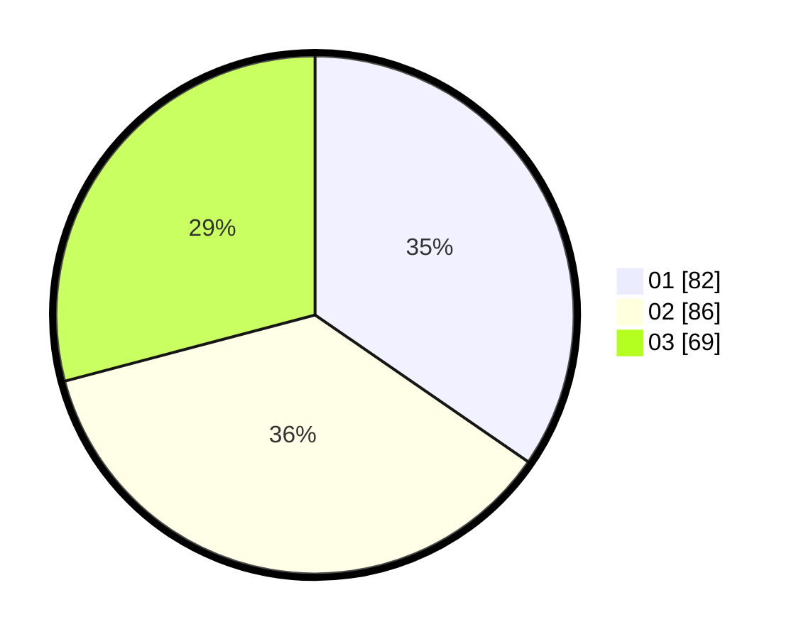

# Hasil

Hasil perolehan suara paslon dapat dilihat pada file paslon-01.txt, paslon-02.txt, dan paslon-03.txt.

Jika tidak ada, artinya data tersebut belum ada pada SIREKAP.

## Perolehan Suara

 * Paslon 01: **82**.
 * Paslon 02: **86**.
 * Paslon 03: **69**.

## Foto C Plano

https://sirekap-obj-formc.kpu.go.id/5a46/pemilu/ppwp/31/75/06/10/06/3175061006091-20240214-195645--1a35b7c0-f87e-4c9f-b0c8-270116e717a5.jpg

https://sirekap-obj-formc.kpu.go.id/5a46/pemilu/ppwp/31/75/06/10/06/3175061006091-20240214-195747--298d033d-5da5-4a8a-aaae-638b1d726413.jpg

https://sirekap-obj-formc.kpu.go.id/5a46/pemilu/ppwp/31/75/06/10/06/3175061006091-20240214-195812--41342092-81aa-4223-829e-730ad12ad433.jpg

## DATA PEMILIH TETAP

Jumlah pemilih dalam DPT: **288**.
 * L: **127**.
 * P: **161**.

## DATA PENGGUNA HAK PILIH

Jumlah pengguna hak pilih dalam DPT: **231**.
 * L: **99**.
 * P: **132**.

Jumlah pengguna hak pilih dalam DPTb: **10**.
 * L: **3**.
 * P: **7**.

Jumlah pengguna hak pilih dalam DPK: **0**.
 * L: **0**.
 * P: **0**.

Jumlah pengguna hak pilih: **241**.
 * L: **102**.
 * P: **139**.

## JUMLAH SUARA SAH DAN TIDAK SAH

JUMLAH SELURUH SUARA SAH: **237**.

JUMLAH SUARA TIDAK SAH: **4**.

JUMLAH SELURUH SUARA SAH DAN SUARA TIDAK SAH: **241**.
