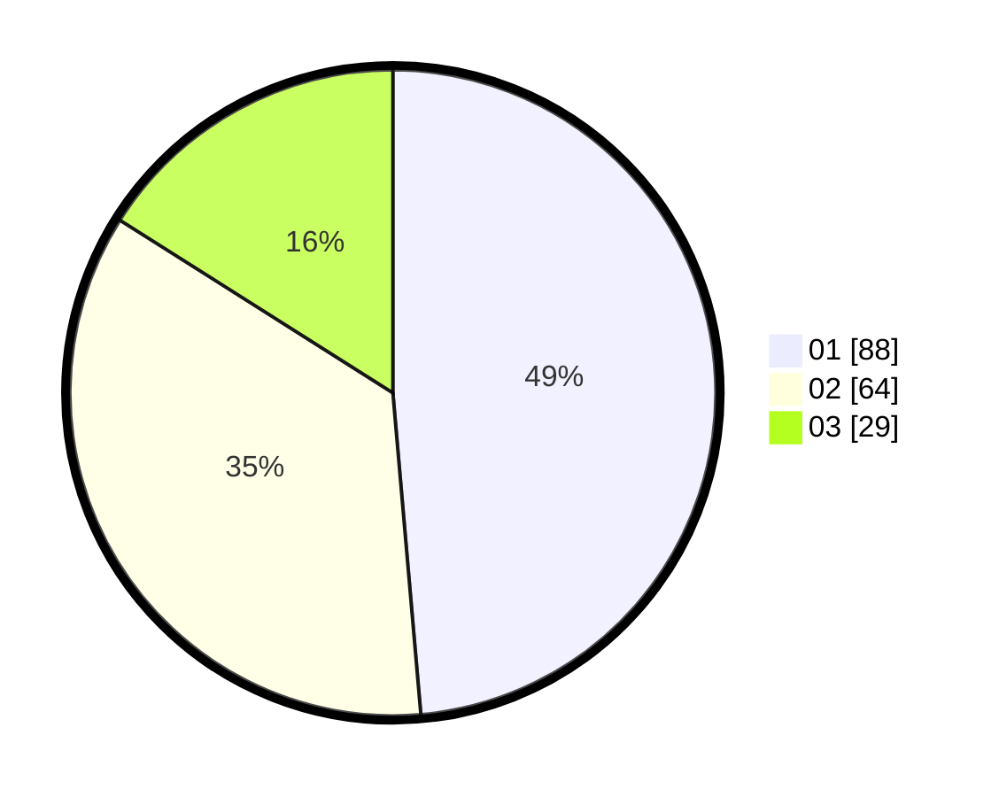

# Hasil

Hasil perolehan suara paslon dapat dilihat pada file paslon-01.txt, paslon-02.txt, dan paslon-03.txt.

Jika tidak ada, artinya data tersebut belum ada pada SIREKAP.

## Perolehan Suara

 * Paslon 01: **88**.
 * Paslon 02: **64**.
 * Paslon 03: **29**.

## Foto C Plano

https://sirekap-obj-formc.kpu.go.id/782f/pemilu/ppwp/31/75/06/10/06/3175061006098-20240217-103019--ea656eff-8c0e-4a27-bf34-b27e7df175a1.jpg

https://sirekap-obj-formc.kpu.go.id/782f/pemilu/ppwp/31/75/06/10/06/3175061006098-20240214-231223--a7148b28-1e77-4140-a432-7252534048dd.jpg

https://sirekap-obj-formc.kpu.go.id/782f/pemilu/ppwp/31/75/06/10/06/3175061006098-20240214-231245--127b1998-76cb-4095-a4f9-69a6fd7f3fed.jpg

## DATA PEMILIH TETAP

Jumlah pemilih dalam DPT: **205**.
 * L: **98**.
 * P: **107**.

## DATA PENGGUNA HAK PILIH

Jumlah pengguna hak pilih dalam DPT: **175**.
 * L: **82**.
 * P: **93**.

Jumlah pengguna hak pilih dalam DPTb: **5**.
 * L: **2**.
 * P: **3**.

Jumlah pengguna hak pilih dalam DPK: **1**.
 * L: **1**.
 * P: **0**.

Jumlah pengguna hak pilih: **181**.
 * L: **85**.
 * P: **96**.

## JUMLAH SUARA SAH DAN TIDAK SAH

JUMLAH SELURUH SUARA SAH: **181**.

JUMLAH SUARA TIDAK SAH: **0**.

JUMLAH SELURUH SUARA SAH DAN SUARA TIDAK SAH: **181**.
