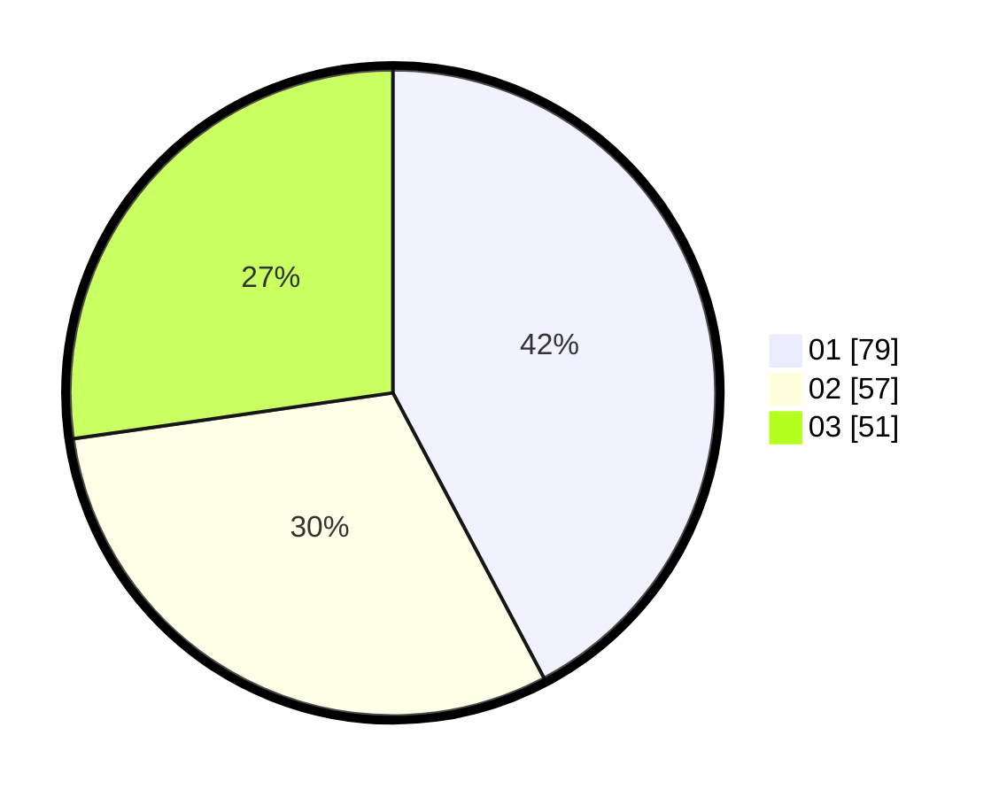

# Hasil

Hasil perolehan suara paslon dapat dilihat pada file paslon-01.txt, paslon-02.txt, dan paslon-03.txt.

Jika tidak ada, artinya data tersebut belum ada pada SIREKAP.

## Perolehan Suara

 * Paslon 01: **79**.
 * Paslon 02: **57**.
 * Paslon 03: **51**.

## Foto C Plano

https://sirekap-obj-formc.kpu.go.id/bf99/pemilu/ppwp/31/75/06/10/06/3175061006099-20240214-205405--34825bb5-3d5c-4b7a-a7fb-96473d9bc048.jpg

https://sirekap-obj-formc.kpu.go.id/bf99/pemilu/ppwp/31/75/06/10/06/3175061006099-20240214-155611--9dc00df1-d445-4bf1-b11f-38e62f84ea6d.jpg

https://sirekap-obj-formc.kpu.go.id/bf99/pemilu/ppwp/31/75/06/10/06/3175061006099-20240214-155706--d8e61ee5-bf48-4c0e-a13f-96bcfb4ac79a.jpg

## DATA PEMILIH TETAP

Jumlah pemilih dalam DPT: **218**.
 * L: **110**.
 * P: **108**.

## DATA PENGGUNA HAK PILIH

Jumlah pengguna hak pilih dalam DPT: **182**.
 * L: **88**.
 * P: **94**.

Jumlah pengguna hak pilih dalam DPTb: **5**.
 * L: **2**.
 * P: **3**.

Jumlah pengguna hak pilih dalam DPK: **2**.
 * L: **1**.
 * P: **1**.

Jumlah pengguna hak pilih: **189**.
 * L: **91**.
 * P: **98**.

## JUMLAH SUARA SAH DAN TIDAK SAH

JUMLAH SELURUH SUARA SAH: **187**.

JUMLAH SUARA TIDAK SAH: **2**.

JUMLAH SELURUH SUARA SAH DAN SUARA TIDAK SAH: **189**.
