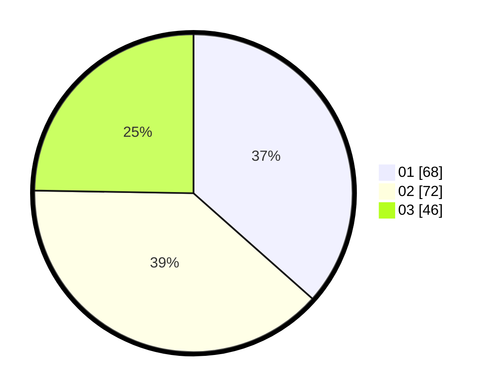

# Hasil

Hasil perolehan suara paslon dapat dilihat pada file paslon-01.txt, paslon-02.txt, dan paslon-03.txt.

Jika tidak ada, artinya data tersebut belum ada pada SIREKAP.

## Perolehan Suara

 * Paslon 01: **68**.
 * Paslon 02: **72**.
 * Paslon 03: **46**.

## Foto C Plano

https://sirekap-obj-formc.kpu.go.id/378f/pemilu/ppwp/31/75/06/10/06/3175061006101-20240214-160118--3b9b775d-b5d5-468d-b0f7-b2eb3bb8fa77.jpg

https://sirekap-obj-formc.kpu.go.id/378f/pemilu/ppwp/31/75/06/10/06/3175061006101-20240214-155547--42dc47c5-6711-4237-ab05-46d1eedef83f.jpg

https://sirekap-obj-formc.kpu.go.id/378f/pemilu/ppwp/31/75/06/10/06/3175061006101-20240214-155529--6848eee3-3ce7-4fcc-8bb3-318004352c11.jpg

## DATA PEMILIH TETAP

Jumlah pemilih dalam DPT: **188**.
 * L: **85**.
 * P: **103**.

## DATA PENGGUNA HAK PILIH

Jumlah pengguna hak pilih dalam DPT: **170**.
 * L: **77**.
 * P: **93**.

Jumlah pengguna hak pilih dalam DPTb: **15**.
 * L: **7**.
 * P: **8**.

Jumlah pengguna hak pilih dalam DPK: **3**.
 * L: **0**.
 * P: **3**.

Jumlah pengguna hak pilih: **188**.
 * L: **84**.
 * P: **104**.

## JUMLAH SUARA SAH DAN TIDAK SAH

JUMLAH SELURUH SUARA SAH: **186**.

JUMLAH SUARA TIDAK SAH: **2**.

JUMLAH SELURUH SUARA SAH DAN SUARA TIDAK SAH: **188**.
