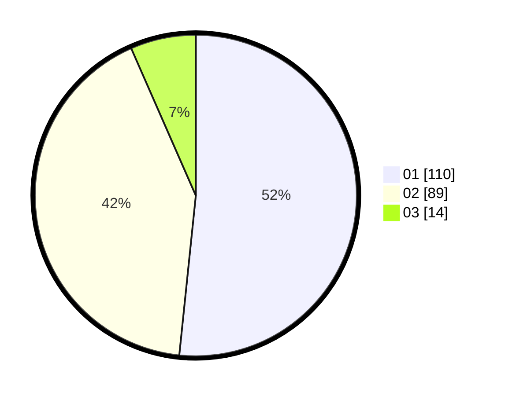

# Hasil

Hasil perolehan suara paslon dapat dilihat pada file paslon-01.txt, paslon-02.txt, dan paslon-03.txt.

Jika tidak ada, artinya data tersebut belum ada pada SIREKAP.

## Perolehan Suara

 * Paslon 01: **110**.
 * Paslon 02: **89**.
 * Paslon 03: **14**.

## Foto C Plano

https://sirekap-obj-formc.kpu.go.id/ce45/pemilu/ppwp/31/75/06/10/07/3175061007004-20240214-222945--cd9e1385-e2e1-4e47-924d-e33864b5c104.jpg

https://sirekap-obj-formc.kpu.go.id/ce45/pemilu/ppwp/31/75/06/10/07/3175061007004-20240214-223059--5a40fe40-ec29-40bb-8ee9-6105fec614cb.jpg

https://sirekap-obj-formc.kpu.go.id/ce45/pemilu/ppwp/31/75/06/10/07/3175061007004-20240214-223141--cf59b044-8046-4f54-bcc2-8dac95f20ef9.jpg
