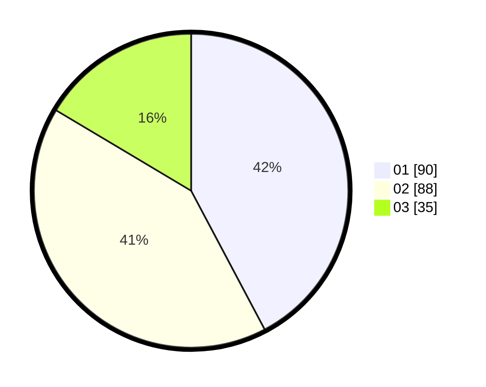

# Hasil

Hasil perolehan suara paslon dapat dilihat pada file paslon-01.txt, paslon-02.txt, dan paslon-03.txt.

Jika tidak ada, artinya data tersebut belum ada pada SIREKAP.

## Perolehan Suara

 * Paslon 01: **90**.
 * Paslon 02: **88**.
 * Paslon 03: **35**.

## Foto C Plano

https://sirekap-obj-formc.kpu.go.id/df48/pemilu/ppwp/31/75/06/10/07/3175061007008-20240214-213634--7284f1ca-57e5-4324-aa7b-db275fb6eecc.jpg

https://sirekap-obj-formc.kpu.go.id/df48/pemilu/ppwp/31/75/06/10/07/3175061007008-20240214-213724--5995ca6d-3508-4c9f-9bad-da559d4bacf2.jpg

https://sirekap-obj-formc.kpu.go.id/df48/pemilu/ppwp/31/75/06/10/07/3175061007008-20240214-213743--1a7404bd-eca4-4e57-ae72-46b37f350198.jpg
