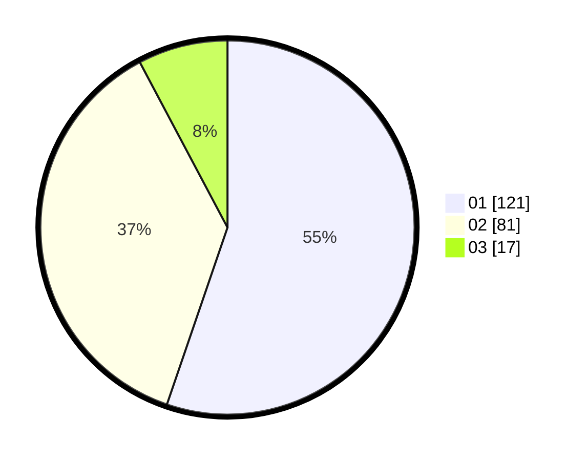

# Hasil

Hasil perolehan suara paslon dapat dilihat pada file paslon-01.txt, paslon-02.txt, dan paslon-03.txt.

Jika tidak ada, artinya data tersebut belum ada pada SIREKAP.

## Perolehan Suara

 * Paslon 01: **121**.
 * Paslon 02: **81**.
 * Paslon 03: **17**.

## Foto C Plano

https://sirekap-obj-formc.kpu.go.id/8c6d/pemilu/ppwp/31/75/06/10/07/3175061007010-20240214-193619--57f76c90-3205-4865-9815-e0e4acc88115.jpg

https://sirekap-obj-formc.kpu.go.id/8c6d/pemilu/ppwp/31/75/06/10/07/3175061007010-20240214-193621--5296866d-966f-412d-a4a9-d640b5297888.jpg

https://sirekap-obj-formc.kpu.go.id/8c6d/pemilu/ppwp/31/75/06/10/07/3175061007010-20240214-193624--998b5952-1e14-4a39-a7c8-2b1156967fd8.jpg

## DATA PEMILIH TETAP

Jumlah pemilih dalam DPT: **281**.
 * L: **142**.
 * P: **139**.

## DATA PENGGUNA HAK PILIH

Jumlah pengguna hak pilih dalam DPT: **213**.
 * L: **106**.
 * P: **107**.

Jumlah pengguna hak pilih dalam DPTb: **3**.
 * L: **2**.
 * P: **1**.

Jumlah pengguna hak pilih dalam DPK: **6**.
 * L: **3**.
 * P: **3**.

Jumlah pengguna hak pilih: **222**.
 * L: **111**.
 * P: **111**.

## JUMLAH SUARA SAH DAN TIDAK SAH

JUMLAH SELURUH SUARA SAH: **219**.

JUMLAH SUARA TIDAK SAH: **3**.

JUMLAH SELURUH SUARA SAH DAN SUARA TIDAK SAH: **222**.
