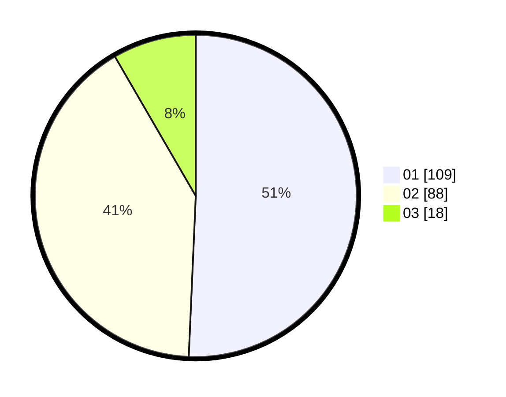

# Hasil

Hasil perolehan suara paslon dapat dilihat pada file paslon-01.txt, paslon-02.txt, dan paslon-03.txt.

Jika tidak ada, artinya data tersebut belum ada pada SIREKAP.

## Perolehan Suara

 * Paslon 01: **109**.
 * Paslon 02: **88**.
 * Paslon 03: **18**.

## Foto C Plano

https://sirekap-obj-formc.kpu.go.id/3de7/pemilu/ppwp/31/75/06/10/07/3175061007011-20240214-193436--1e35aab3-c781-43fa-b256-4196a173e956.jpg

https://sirekap-obj-formc.kpu.go.id/3de7/pemilu/ppwp/31/75/06/10/07/3175061007011-20240214-193508--29471cc3-0d5a-4445-a501-da5064463b44.jpg

https://sirekap-obj-formc.kpu.go.id/3de7/pemilu/ppwp/31/75/06/10/07/3175061007011-20240214-193514--3ac66c18-5623-4707-8eba-46aede2a897e.jpg

## DATA PEMILIH TETAP

Jumlah pemilih dalam DPT: **283**.
 * L: **146**.
 * P: **137**.

## DATA PENGGUNA HAK PILIH

Jumlah pengguna hak pilih dalam DPT: **217**.
 * L: **110**.
 * P: **107**.

Jumlah pengguna hak pilih dalam DPTb: **4**.
 * L: **4**.
 * P: **0**.

Jumlah pengguna hak pilih dalam DPK: **0**.
 * L: **0**.
 * P: **0**.

Jumlah pengguna hak pilih: **221**.
 * L: **114**.
 * P: **107**.

## JUMLAH SUARA SAH DAN TIDAK SAH

JUMLAH SELURUH SUARA SAH: **215**.

JUMLAH SUARA TIDAK SAH: **6**.

JUMLAH SELURUH SUARA SAH DAN SUARA TIDAK SAH: **221**.
