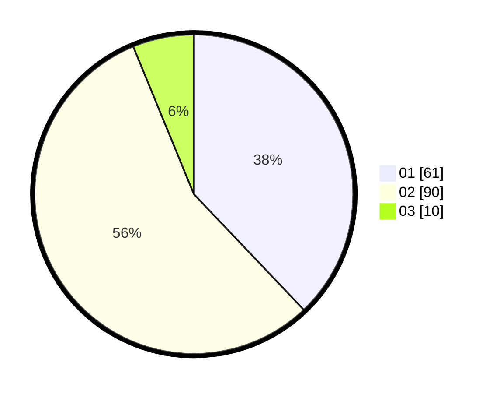

# Hasil

Hasil perolehan suara paslon dapat dilihat pada file paslon-01.txt, paslon-02.txt, dan paslon-03.txt.

Jika tidak ada, artinya data tersebut belum ada pada SIREKAP.

## Perolehan Suara

 * Paslon 01: **61**.
 * Paslon 02: **90**.
 * Paslon 03: **10**.

## Foto C Plano

https://sirekap-obj-formc.kpu.go.id/b5a8/pemilu/ppwp/31/75/06/10/07/3175061007035-20240214-185658--7e8fbbcd-31ff-4886-a886-b1c579743881.jpg

https://sirekap-obj-formc.kpu.go.id/b5a8/pemilu/ppwp/31/75/06/10/07/3175061007035-20240214-185859--d146d332-ac08-4f30-b251-be01c4705dec.jpg

https://sirekap-obj-formc.kpu.go.id/b5a8/pemilu/ppwp/31/75/06/10/07/3175061007035-20240214-185813--71e7cced-1dee-47cf-91d0-0775f8ca0fc8.jpg

## DATA PEMILIH TETAP

Jumlah pemilih dalam DPT: **251**.
 * L: **125**.
 * P: **126**.

## DATA PENGGUNA HAK PILIH

Jumlah pengguna hak pilih dalam DPT: **155**.
 * L: **72**.
 * P: **83**.

Jumlah pengguna hak pilih dalam DPTb: **0**.
 * L: **0**.
 * P: **0**.

Jumlah pengguna hak pilih dalam DPK: **7**.
 * L: **2**.
 * P: **5**.

Jumlah pengguna hak pilih: **162**.
 * L: **74**.
 * P: **88**.

## JUMLAH SUARA SAH DAN TIDAK SAH

JUMLAH SELURUH SUARA SAH: **161**.

JUMLAH SUARA TIDAK SAH: **2**.

JUMLAH SELURUH SUARA SAH DAN SUARA TIDAK SAH: **163**.
