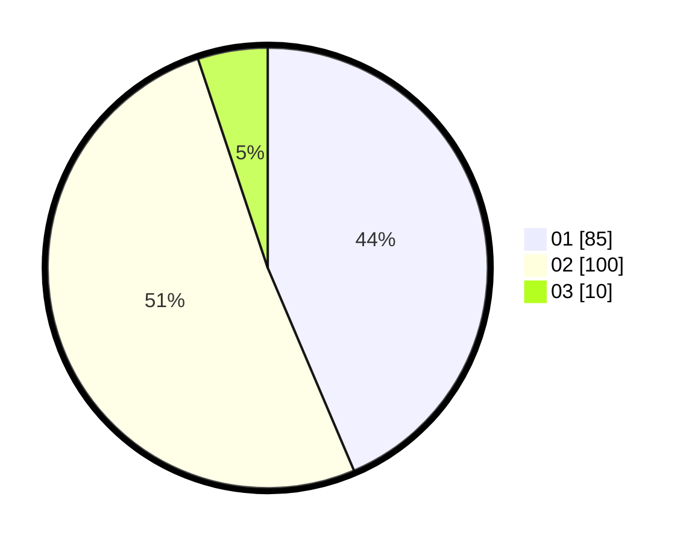

# Hasil

Hasil perolehan suara paslon dapat dilihat pada file paslon-01.txt, paslon-02.txt, dan paslon-03.txt.

Jika tidak ada, artinya data tersebut belum ada pada SIREKAP.

## Perolehan Suara

 * Paslon 01: **85**.
 * Paslon 02: **100**.
 * Paslon 03: **10**.

## Foto C Plano

https://sirekap-obj-formc.kpu.go.id/7284/pemilu/ppwp/31/75/06/10/07/3175061007036-20240214-191846--5e62eaba-d11d-4cce-a471-96de647d5857.jpg

https://sirekap-obj-formc.kpu.go.id/7284/pemilu/ppwp/31/75/06/10/07/3175061007036-20240214-191907--a1cd6e3b-ca18-466a-bc6b-c14fd799d12b.jpg

https://sirekap-obj-formc.kpu.go.id/7284/pemilu/ppwp/31/75/06/10/07/3175061007036-20240214-191914--1a8c2941-ea07-4dae-923c-497395217273.jpg

## DATA PEMILIH TETAP

Jumlah pemilih dalam DPT: **247**.
 * L: **130**.
 * P: **117**.

## DATA PENGGUNA HAK PILIH

Jumlah pengguna hak pilih dalam DPT: **195**.
 * L: **101**.
 * P: **94**.

Jumlah pengguna hak pilih dalam DPTb: **0**.
 * L: **0**.
 * P: **0**.

Jumlah pengguna hak pilih dalam DPK: **1**.
 * L: **0**.
 * P: **1**.

Jumlah pengguna hak pilih: **196**.
 * L: **101**.
 * P: **95**.

## JUMLAH SUARA SAH DAN TIDAK SAH

JUMLAH SELURUH SUARA SAH: **195**.

JUMLAH SUARA TIDAK SAH: **1**.

JUMLAH SELURUH SUARA SAH DAN SUARA TIDAK SAH: **196**.
