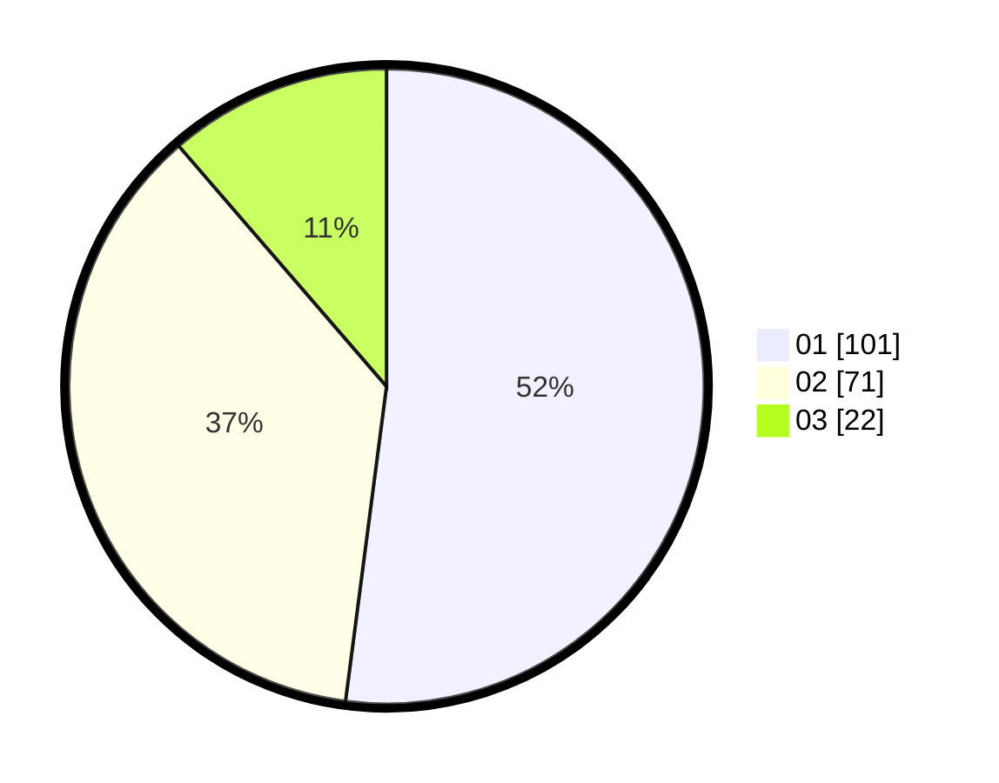

# Hasil

Hasil perolehan suara paslon dapat dilihat pada file paslon-01.txt, paslon-02.txt, dan paslon-03.txt.

Jika tidak ada, artinya data tersebut belum ada pada SIREKAP.

## Perolehan Suara

 * Paslon 01: **101**.
 * Paslon 02: **71**.
 * Paslon 03: **22**.

## Foto C Plano

https://sirekap-obj-formc.kpu.go.id/4f2a/pemilu/ppwp/31/75/06/10/07/3175061007045-20240216-134707--39b293dc-3cd0-4ee9-93ce-65f22f8f7bd6.jpg

https://sirekap-obj-formc.kpu.go.id/4f2a/pemilu/ppwp/31/75/06/10/07/3175061007045-20240216-134708--f5015e91-d737-46c9-86a0-55520be28366.jpg

https://sirekap-obj-formc.kpu.go.id/4f2a/pemilu/ppwp/31/75/06/10/07/3175061007045-20240216-134708--ce72fadc-6341-485a-ae80-56437ff5186b.jpg

## DATA PEMILIH TETAP

Jumlah pemilih dalam DPT: **255**.
 * L: **136**.
 * P: **119**.

## DATA PENGGUNA HAK PILIH

Jumlah pengguna hak pilih dalam DPT: **197**.
 * L: **103**.
 * P: **94**.

Jumlah pengguna hak pilih dalam DPTb: **0**.
 * L: **0**.
 * P: **0**.

Jumlah pengguna hak pilih dalam DPK: **1**.
 * L: **1**.
 * P: **0**.

Jumlah pengguna hak pilih: **198**.
 * L: **104**.
 * P: **94**.

## JUMLAH SUARA SAH DAN TIDAK SAH

JUMLAH SELURUH SUARA SAH: **194**.

JUMLAH SUARA TIDAK SAH: **4**.

JUMLAH SELURUH SUARA SAH DAN SUARA TIDAK SAH: **198**.
