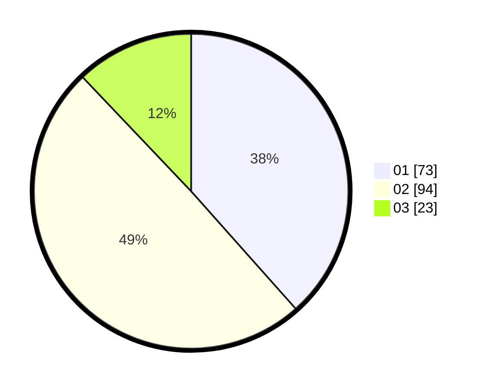

# Hasil

Hasil perolehan suara paslon dapat dilihat pada file paslon-01.txt, paslon-02.txt, dan paslon-03.txt.

Jika tidak ada, artinya data tersebut belum ada pada SIREKAP.

## Perolehan Suara

 * Paslon 01: **73**.
 * Paslon 02: **94**.
 * Paslon 03: **23**.

## Foto C Plano

https://sirekap-obj-formc.kpu.go.id/da52/pemilu/ppwp/31/75/06/10/07/3175061007046-20240214-215548--33f1194c-cc61-405a-b4cc-89faef96e087.jpg

https://sirekap-obj-formc.kpu.go.id/da52/pemilu/ppwp/31/75/06/10/07/3175061007046-20240214-214102--bc1fd966-c21c-4995-9575-abe62eb6e18b.jpg

https://sirekap-obj-formc.kpu.go.id/da52/pemilu/ppwp/31/75/06/10/07/3175061007046-20240214-213600--3b8a859a-46f8-4b0d-9302-bec44a7d3a93.jpg
