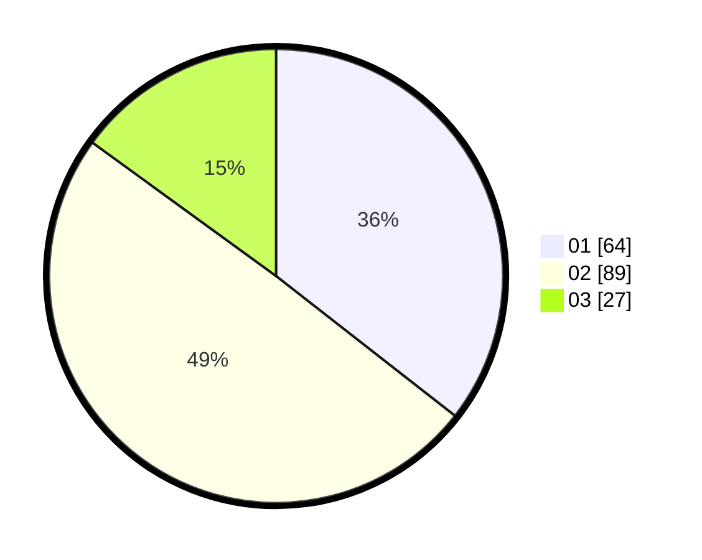

# Hasil

Hasil perolehan suara paslon dapat dilihat pada file paslon-01.txt, paslon-02.txt, dan paslon-03.txt.

Jika tidak ada, artinya data tersebut belum ada pada SIREKAP.

## Perolehan Suara

 * Paslon 01: **64**.
 * Paslon 02: **89**.
 * Paslon 03: **27**.

## Foto C Plano

https://sirekap-obj-formc.kpu.go.id/269a/pemilu/ppwp/31/75/06/10/07/3175061007047-20240215-025940--7e99c9b6-25eb-4b6a-92b0-795994e2ee1a.jpg

https://sirekap-obj-formc.kpu.go.id/269a/pemilu/ppwp/31/75/06/10/07/3175061007047-20240215-023201--d521ca1d-98cd-4c23-a489-ab8f089aaff6.jpg

https://sirekap-obj-formc.kpu.go.id/269a/pemilu/ppwp/31/75/06/10/07/3175061007047-20240214-225655--5ea8d30f-6012-4b0b-bbac-9c339e9847b5.jpg
