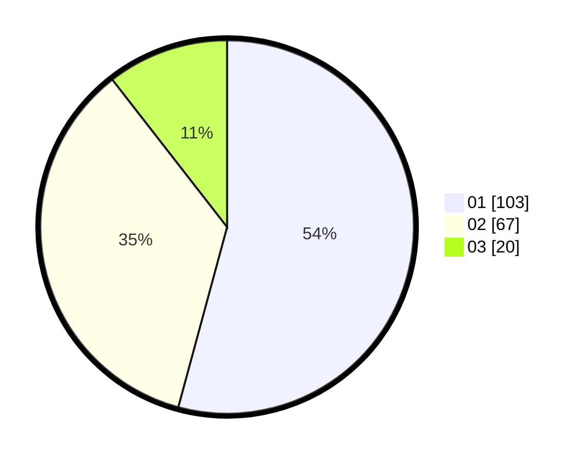

# Hasil

Hasil perolehan suara paslon dapat dilihat pada file paslon-01.txt, paslon-02.txt, dan paslon-03.txt.

Jika tidak ada, artinya data tersebut belum ada pada SIREKAP.

## Perolehan Suara

 * Paslon 01: **103**.
 * Paslon 02: **67**.
 * Paslon 03: **20**.

## Foto C Plano

https://sirekap-obj-formc.kpu.go.id/88c2/pemilu/ppwp/31/75/06/10/07/3175061007049-20240214-191612--569077ee-b411-4625-9f88-790da0c3b765.jpg

https://sirekap-obj-formc.kpu.go.id/88c2/pemilu/ppwp/31/75/06/10/07/3175061007049-20240214-191628--29a47d96-0f4b-4c2f-8652-e565f8764aaf.jpg

https://sirekap-obj-formc.kpu.go.id/88c2/pemilu/ppwp/31/75/06/10/07/3175061007049-20240214-191638--cf99887f-04f9-411e-8171-b52043fd3df7.jpg

## DATA PEMILIH TETAP

Jumlah pemilih dalam DPT: **258**.
 * L: **135**.
 * P: **123**.

## DATA PENGGUNA HAK PILIH

Jumlah pengguna hak pilih dalam DPT: **193**.
 * L: **92**.
 * P: **101**.

Jumlah pengguna hak pilih dalam DPTb: **0**.
 * L: **0**.
 * P: **0**.

Jumlah pengguna hak pilih dalam DPK: **0**.
 * L: **0**.
 * P: **0**.

Jumlah pengguna hak pilih: **193**.
 * L: **92**.
 * P: **101**.

## JUMLAH SUARA SAH DAN TIDAK SAH

JUMLAH SELURUH SUARA SAH: **190**.

JUMLAH SUARA TIDAK SAH: **3**.

JUMLAH SELURUH SUARA SAH DAN SUARA TIDAK SAH: **193**.
