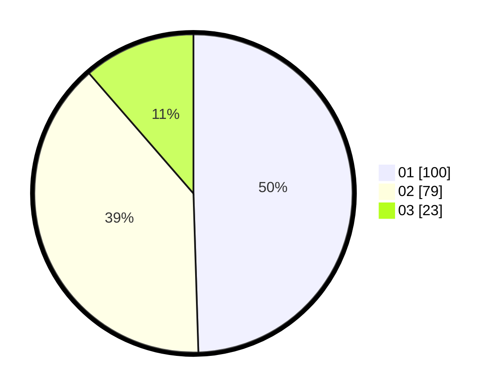

# Hasil

Hasil perolehan suara paslon dapat dilihat pada file paslon-01.txt, paslon-02.txt, dan paslon-03.txt.

Jika tidak ada, artinya data tersebut belum ada pada SIREKAP.

## Perolehan Suara

 * Paslon 01: **100**.
 * Paslon 02: **79**.
 * Paslon 03: **23**.

## Foto C Plano

https://sirekap-obj-formc.kpu.go.id/dfc9/pemilu/ppwp/31/75/06/10/07/3175061007050-20240215-001453--06a93b3d-1878-4bbf-b8ce-a148aa830972.jpg

https://sirekap-obj-formc.kpu.go.id/dfc9/pemilu/ppwp/31/75/06/10/07/3175061007050-20240215-001719--455d8fb4-9b25-4045-bd76-a8fc2897f845.jpg

https://sirekap-obj-formc.kpu.go.id/dfc9/pemilu/ppwp/31/75/06/10/07/3175061007050-20240215-001913--8af320c6-28f0-41ba-b262-f997c778b16e.jpg
