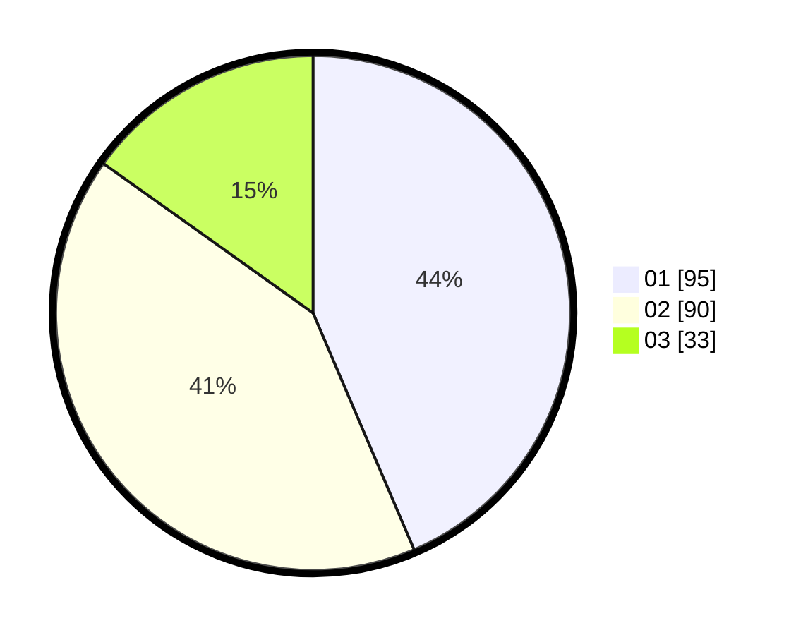

# Hasil

Hasil perolehan suara paslon dapat dilihat pada file paslon-01.txt, paslon-02.txt, dan paslon-03.txt.

Jika tidak ada, artinya data tersebut belum ada pada SIREKAP.

## Perolehan Suara

 * Paslon 01: **95**.
 * Paslon 02: **90**.
 * Paslon 03: **33**.

## Foto C Plano

https://sirekap-obj-formc.kpu.go.id/5efc/pemilu/ppwp/31/75/06/10/07/3175061007053-20240214-155132--196fc494-587b-48f7-a02b-143019b2affc.jpg

https://sirekap-obj-formc.kpu.go.id/5efc/pemilu/ppwp/31/75/06/10/07/3175061007053-20240214-160117--79537490-f78e-4e1f-b067-600324ba1367.jpg

https://sirekap-obj-formc.kpu.go.id/5efc/pemilu/ppwp/31/75/06/10/07/3175061007053-20240214-155201--40bf593e-bd76-4cb7-9b8d-e1ec4e266c11.jpg

## DATA PEMILIH TETAP

Jumlah pemilih dalam DPT: **278**.
 * L: **130**.
 * P: **148**.

## DATA PENGGUNA HAK PILIH

Jumlah pengguna hak pilih dalam DPT: **217**.
 * L: **99**.
 * P: **118**.

Jumlah pengguna hak pilih dalam DPTb: **0**.
 * L: **0**.
 * P: **0**.

Jumlah pengguna hak pilih dalam DPK: **1**.
 * L: **0**.
 * P: **1**.

Jumlah pengguna hak pilih: **218**.
 * L: **99**.
 * P: **119**.

## JUMLAH SUARA SAH DAN TIDAK SAH

JUMLAH SELURUH SUARA SAH: **218**.

JUMLAH SUARA TIDAK SAH: **0**.

JUMLAH SELURUH SUARA SAH DAN SUARA TIDAK SAH: **218**.
