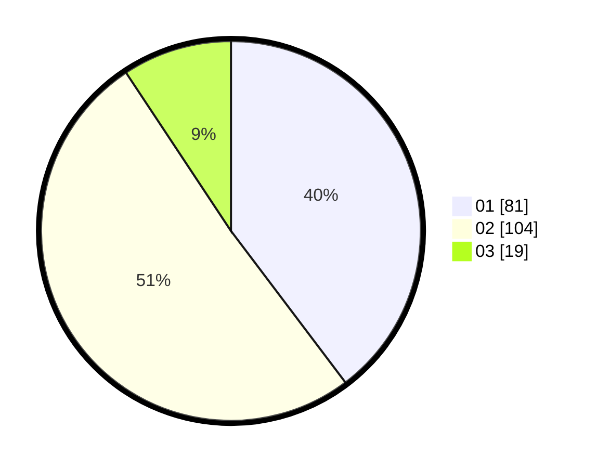

# Hasil

Hasil perolehan suara paslon dapat dilihat pada file paslon-01.txt, paslon-02.txt, dan paslon-03.txt.

Jika tidak ada, artinya data tersebut belum ada pada SIREKAP.

## Perolehan Suara

 * Paslon 01: **81**.
 * Paslon 02: **104**.
 * Paslon 03: **19**.

## Foto C Plano

https://sirekap-obj-formc.kpu.go.id/a1ab/pemilu/ppwp/31/75/06/10/07/3175061007059-20240214-202833--b8e8383c-5cdb-4bc0-8d09-57aade687311.jpg

https://sirekap-obj-formc.kpu.go.id/a1ab/pemilu/ppwp/31/75/06/10/07/3175061007059-20240214-202851--d3408d4e-bc4f-46bf-856d-517e2a4f5ef9.jpg

https://sirekap-obj-formc.kpu.go.id/a1ab/pemilu/ppwp/31/75/06/10/07/3175061007059-20240216-171729--1ec97a00-68aa-4ac1-bbfb-83c6469cd24e.jpg

## DATA PEMILIH TETAP

Jumlah pemilih dalam DPT: **261**.
 * L: **140**.
 * P: **121**.

## DATA PENGGUNA HAK PILIH

Jumlah pengguna hak pilih dalam DPT: **205**.
 * L: **105**.
 * P: **100**.

Jumlah pengguna hak pilih dalam DPTb: **2**.
 * L: **0**.
 * P: **2**.

Jumlah pengguna hak pilih dalam DPK: **1**.
 * L: **0**.
 * P: **1**.

Jumlah pengguna hak pilih: **208**.
 * L: **105**.
 * P: **103**.

## JUMLAH SUARA SAH DAN TIDAK SAH

JUMLAH SELURUH SUARA SAH: **204**.

JUMLAH SUARA TIDAK SAH: **4**.

JUMLAH SELURUH SUARA SAH DAN SUARA TIDAK SAH: **208**.
