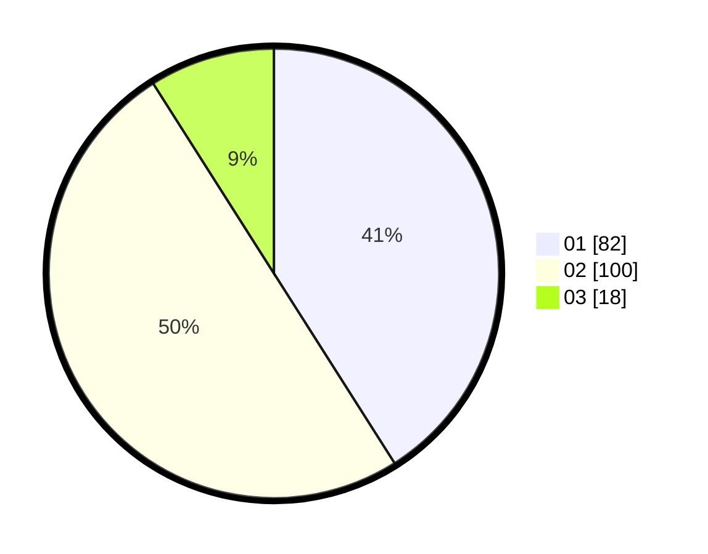

# Hasil

Hasil perolehan suara paslon dapat dilihat pada file paslon-01.txt, paslon-02.txt, dan paslon-03.txt.

Jika tidak ada, artinya data tersebut belum ada pada SIREKAP.

## Perolehan Suara

 * Paslon 01: **82**.
 * Paslon 02: **100**.
 * Paslon 03: **18**.

## Foto C Plano

https://sirekap-obj-formc.kpu.go.id/0a1d/pemilu/ppwp/31/75/06/10/07/3175061007060-20240216-131618--7215bf1a-0345-47fb-a7bb-1f227226de96.jpg

https://sirekap-obj-formc.kpu.go.id/0a1d/pemilu/ppwp/31/75/06/10/07/3175061007060-20240216-131620--9ece699f-7e2e-4a8b-9556-3e1ae3487413.jpg

https://sirekap-obj-formc.kpu.go.id/0a1d/pemilu/ppwp/31/75/06/10/07/3175061007060-20240216-131619--b3c3d873-06a6-4a19-a9ea-087fb4552d8d.jpg

## DATA PEMILIH TETAP

Jumlah pemilih dalam DPT: **263**.
 * L: **138**.
 * P: **125**.

## DATA PENGGUNA HAK PILIH

Jumlah pengguna hak pilih dalam DPT: **200**.
 * L: **102**.
 * P: **98**.

Jumlah pengguna hak pilih dalam DPTb: **1**.
 * L: **1**.
 * P: **0**.

Jumlah pengguna hak pilih dalam DPK: **0**.
 * L: **0**.
 * P: **0**.

Jumlah pengguna hak pilih: **201**.
 * L: **103**.
 * P: **98**.

## JUMLAH SUARA SAH DAN TIDAK SAH

JUMLAH SELURUH SUARA SAH: **200**.

JUMLAH SUARA TIDAK SAH: **1**.

JUMLAH SELURUH SUARA SAH DAN SUARA TIDAK SAH: **201**.
