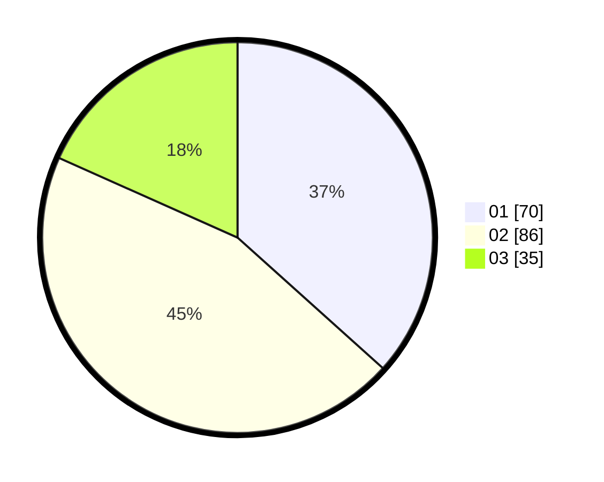

# Hasil

Hasil perolehan suara paslon dapat dilihat pada file paslon-01.txt, paslon-02.txt, dan paslon-03.txt.

Jika tidak ada, artinya data tersebut belum ada pada SIREKAP.

## Perolehan Suara

 * Paslon 01: **70**.
 * Paslon 02: **86**.
 * Paslon 03: **35**.

## Foto C Plano

https://sirekap-obj-formc.kpu.go.id/c583/pemilu/ppwp/31/75/06/10/07/3175061007085-20240214-192244--9448dbc1-52fe-4429-b781-8b8de0e70a60.jpg

https://sirekap-obj-formc.kpu.go.id/c583/pemilu/ppwp/31/75/06/10/07/3175061007085-20240214-191424--a7d0e8d2-b6e9-4511-8693-4e979d83d40b.jpg

https://sirekap-obj-formc.kpu.go.id/c583/pemilu/ppwp/31/75/06/10/07/3175061007085-20240214-192648--c6d9bf72-f228-42ea-9e81-0a1456bf3a0a.jpg

## DATA PEMILIH TETAP

Jumlah pemilih dalam DPT: **267**.
 * L: **128**.
 * P: **139**.

## DATA PENGGUNA HAK PILIH

Jumlah pengguna hak pilih dalam DPT: **194**.
 * L: **88**.
 * P: **106**.

Jumlah pengguna hak pilih dalam DPTb: **0**.
 * L: **0**.
 * P: **0**.

Jumlah pengguna hak pilih dalam DPK: **2**.
 * L: **1**.
 * P: **1**.

Jumlah pengguna hak pilih: **196**.
 * L: **89**.
 * P: **107**.

## JUMLAH SUARA SAH DAN TIDAK SAH

JUMLAH SELURUH SUARA SAH: **191**.

JUMLAH SUARA TIDAK SAH: **5**.

JUMLAH SELURUH SUARA SAH DAN SUARA TIDAK SAH: **196**.
