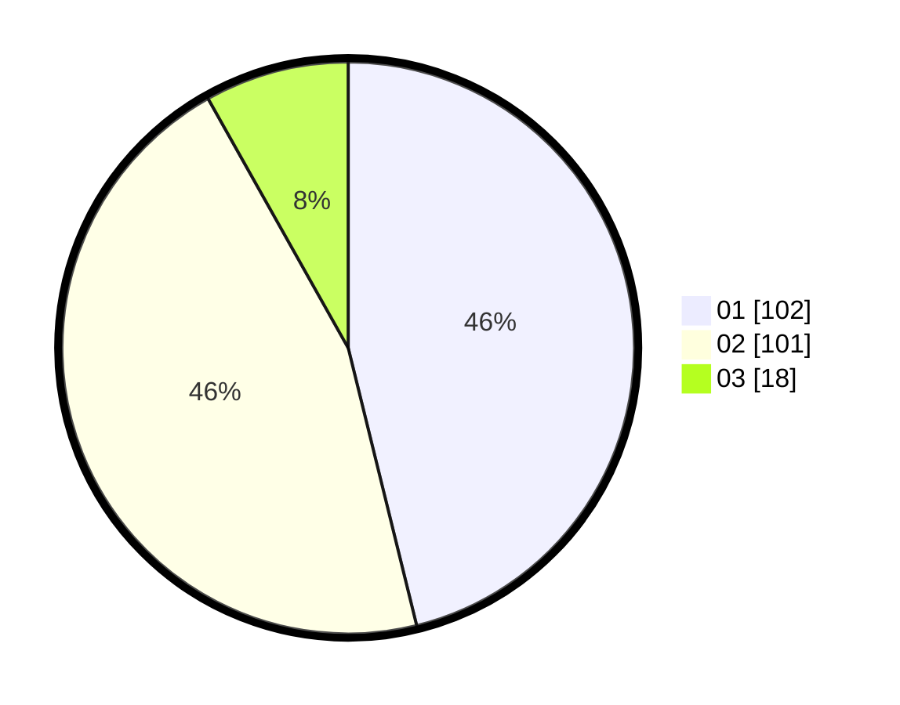

# Hasil

Hasil perolehan suara paslon dapat dilihat pada file paslon-01.txt, paslon-02.txt, dan paslon-03.txt.

Jika tidak ada, artinya data tersebut belum ada pada SIREKAP.

## Perolehan Suara

 * Paslon 01: **102**.
 * Paslon 02: **101**.
 * Paslon 03: **18**.

## Foto C Plano

https://sirekap-obj-formc.kpu.go.id/aa63/pemilu/ppwp/31/75/06/10/07/3175061007103-20240216-000524--92e1e515-84a2-486d-8e4e-bfe27663daa9.jpg

https://sirekap-obj-formc.kpu.go.id/aa63/pemilu/ppwp/31/75/06/10/07/3175061007103-20240216-000526--be529718-3d80-4be4-ac85-9d0115bf2b6e.jpg

https://sirekap-obj-formc.kpu.go.id/aa63/pemilu/ppwp/31/75/06/10/07/3175061007103-20240216-000525--bd7610fe-3f22-44e5-8d27-ebe69e8fd131.jpg

## DATA PEMILIH TETAP

Jumlah pemilih dalam DPT: **269**.
 * L: **141**.
 * P: **128**.

## DATA PENGGUNA HAK PILIH

Jumlah pengguna hak pilih dalam DPT: **225**.
 * L: **117**.
 * P: **108**.

Jumlah pengguna hak pilih dalam DPTb: **0**.
 * L: **0**.
 * P: **0**.

Jumlah pengguna hak pilih dalam DPK: **0**.
 * L: **0**.
 * P: **0**.

Jumlah pengguna hak pilih: **225**.
 * L: **117**.
 * P: **108**.

## JUMLAH SUARA SAH DAN TIDAK SAH

JUMLAH SELURUH SUARA SAH: **221**.

JUMLAH SUARA TIDAK SAH: **4**.

JUMLAH SELURUH SUARA SAH DAN SUARA TIDAK SAH: **225**.
