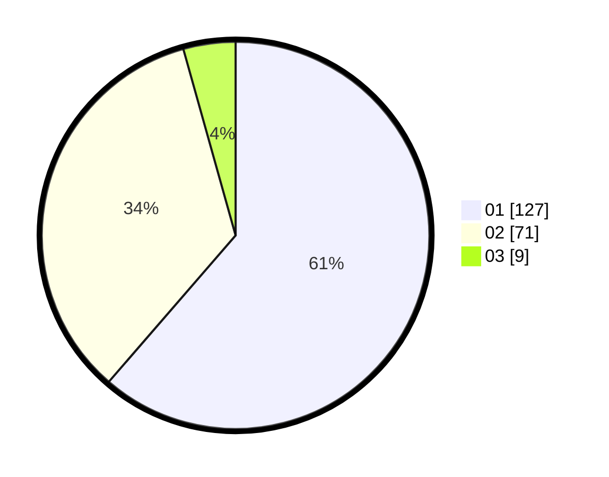

# Hasil

Hasil perolehan suara paslon dapat dilihat pada file paslon-01.txt, paslon-02.txt, dan paslon-03.txt.

Jika tidak ada, artinya data tersebut belum ada pada SIREKAP.

## Perolehan Suara

 * Paslon 01: **127**.
 * Paslon 02: **71**.
 * Paslon 03: **9**.

## Foto C Plano

https://sirekap-obj-formc.kpu.go.id/23b4/pemilu/ppwp/31/75/06/10/07/3175061007115-20240214-212039--12292509-86ac-4220-9aec-2365017e47f1.jpg

https://sirekap-obj-formc.kpu.go.id/23b4/pemilu/ppwp/31/75/06/10/07/3175061007115-20240214-223700--f2706ff8-2cec-4fea-9e79-b5302fdef7ee.jpg

https://sirekap-obj-formc.kpu.go.id/23b4/pemilu/ppwp/31/75/06/10/07/3175061007115-20240214-212251--fc80a649-9953-43af-af96-42a6a0e8fa6d.jpg
