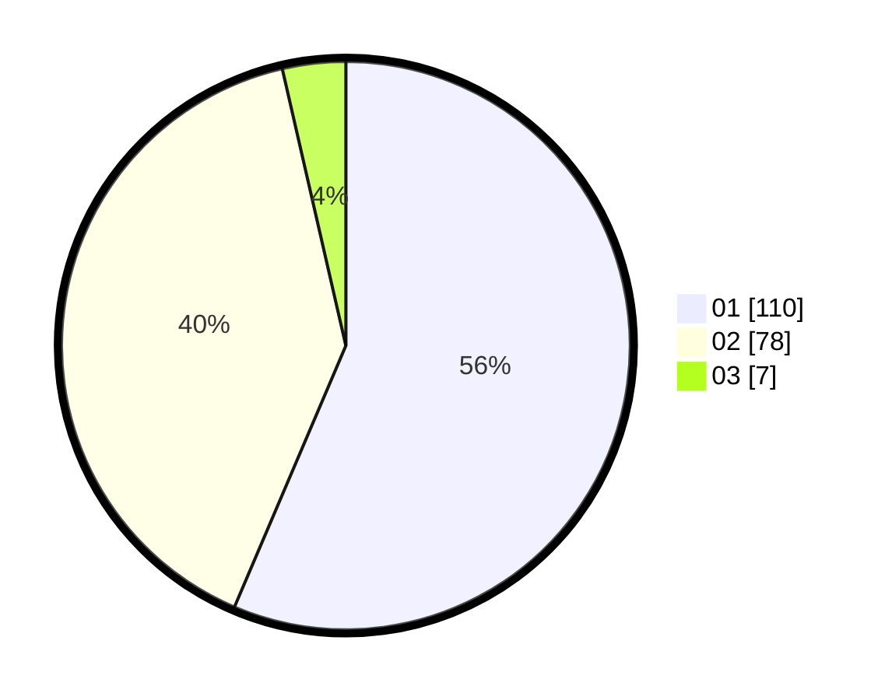

# Hasil

Hasil perolehan suara paslon dapat dilihat pada file paslon-01.txt, paslon-02.txt, dan paslon-03.txt.

Jika tidak ada, artinya data tersebut belum ada pada SIREKAP.

## Perolehan Suara

 * Paslon 01: **110**.
 * Paslon 02: **78**.
 * Paslon 03: **7**.

## Foto C Plano

https://sirekap-obj-formc.kpu.go.id/119f/pemilu/ppwp/31/75/06/10/07/3175061007116-20240216-054107--5694af87-f424-4a46-948c-63cdb04706f8.jpg

https://sirekap-obj-formc.kpu.go.id/119f/pemilu/ppwp/31/75/06/10/07/3175061007116-20240214-194012--c11624b8-336a-4f5f-ad46-b7d3dc9219e0.jpg

https://sirekap-obj-formc.kpu.go.id/119f/pemilu/ppwp/31/75/06/10/07/3175061007116-20240216-042715--0cf1c5bf-0c51-4dac-844d-69edd8cb9117.jpg

## DATA PEMILIH TETAP

Jumlah pemilih dalam DPT: **0**.
 * L: **0**.
 * P: **0**.

## DATA PENGGUNA HAK PILIH

Jumlah pengguna hak pilih dalam DPT: **264**.
 * L: **135**.
 * P: **129**.

Jumlah pengguna hak pilih dalam DPTb: **194**.
 * L: **95**.
 * P: **99**.

Jumlah pengguna hak pilih dalam DPK: **0**.
 * L: **0**.
 * P: **0**.

Jumlah pengguna hak pilih: **197**.
 * L: **97**.
 * P: **100**.

## JUMLAH SUARA SAH DAN TIDAK SAH

JUMLAH SELURUH SUARA SAH: **195**.

JUMLAH SUARA TIDAK SAH: **2**.

JUMLAH SELURUH SUARA SAH DAN SUARA TIDAK SAH: **197**.
