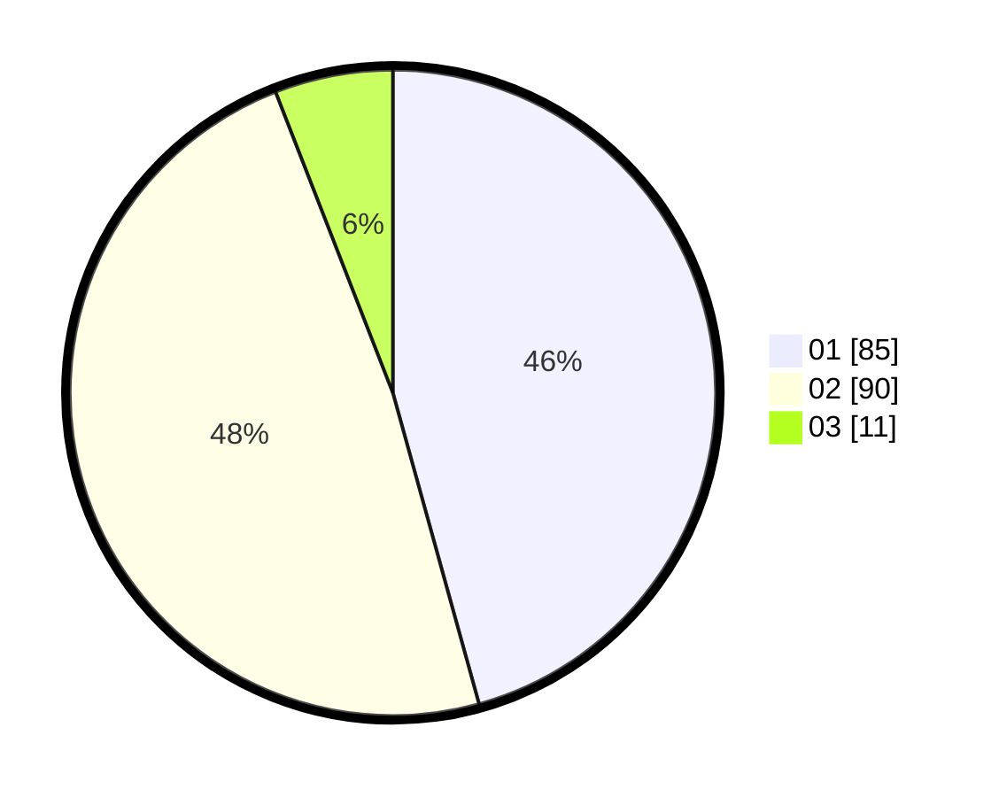

# Hasil

Hasil perolehan suara paslon dapat dilihat pada file paslon-01.txt, paslon-02.txt, dan paslon-03.txt.

Jika tidak ada, artinya data tersebut belum ada pada SIREKAP.

## Perolehan Suara

 * Paslon 01: **85**.
 * Paslon 02: **90**.
 * Paslon 03: **11**.

## Foto C Plano

https://sirekap-obj-formc.kpu.go.id/3c23/pemilu/ppwp/31/75/06/10/07/3175061007118-20240214-211657--b00eeb81-c7dd-43ef-81c2-999788ea74f2.jpg

https://sirekap-obj-formc.kpu.go.id/3c23/pemilu/ppwp/31/75/06/10/07/3175061007118-20240214-211702--24dcb136-2073-41e2-9f1f-7fde6a2bc8b5.jpg

https://sirekap-obj-formc.kpu.go.id/3c23/pemilu/ppwp/31/75/06/10/07/3175061007118-20240214-211705--a34639e2-cae6-4b37-aa58-1ce75bc70d70.jpg

## DATA PEMILIH TETAP

Jumlah pemilih dalam DPT: **248**.
 * L: **140**.
 * P: **108**.

## DATA PENGGUNA HAK PILIH

Jumlah pengguna hak pilih dalam DPT: **187**.
 * L: **108**.
 * P: **79**.

Jumlah pengguna hak pilih dalam DPTb: **0**.
 * L: **0**.
 * P: **0**.

Jumlah pengguna hak pilih dalam DPK: **0**.
 * L: **0**.
 * P: **0**.

Jumlah pengguna hak pilih: **187**.
 * L: **108**.
 * P: **79**.

## JUMLAH SUARA SAH DAN TIDAK SAH

JUMLAH SELURUH SUARA SAH: **186**.

JUMLAH SUARA TIDAK SAH: **1**.

JUMLAH SELURUH SUARA SAH DAN SUARA TIDAK SAH: **187**.
